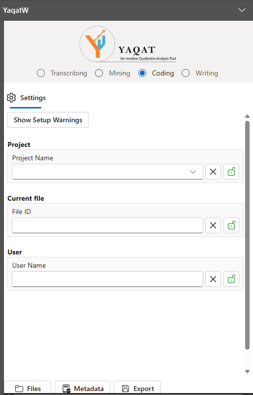
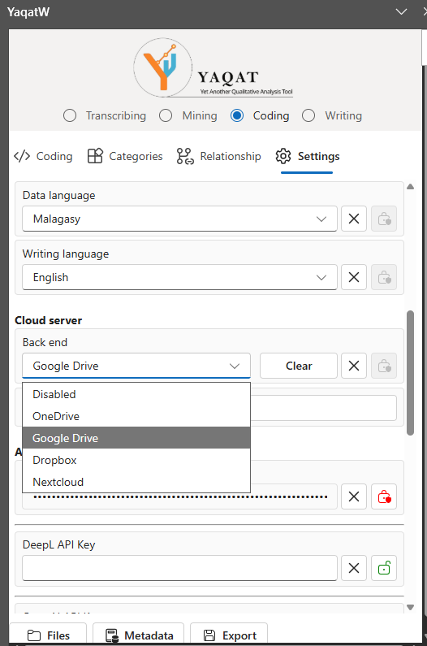
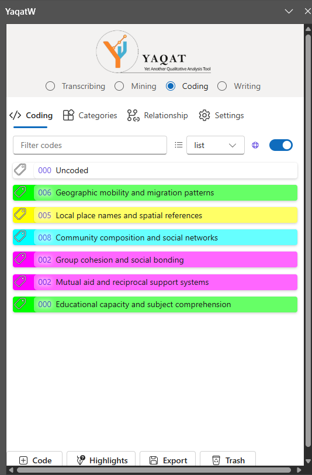

# YaqatW User Guide

**Yet Another Qualitative Analysis Tool for Word**

Welcome to YaqatW! This guide will help you get started with qualitative coding, annotation, and thematic analysis in Microsoft Word.

## Table of Contents

1. [What is YaqatW?](#what-is-yaqatw)
2. [Installation](#installation)
3. [Getting Started](#getting-started)
4. [Key Features](#key-features)
5. [Workflow Guide](#workflow-guide)
6. [Cloud Sync](#cloud-sync)
7. [Encryption & Security](#encryption--security)
8. [Export & Analysis](#export--analysis)
9. [AI & Translation](#ai--translation)
10. [Troubleshooting](#troubleshooting)
11. [FAQ](#faq)

---

## What is YaqatW?

YaqatW is a Microsoft Word add-in designed for researchers, students, and analysts who conduct qualitative analysis. It enables you to:

- **Code** text excerpts with custom codes and colors
- **Organize** codes into categories and hierarchies
- **Document** relationships between codes and concepts
- **Annotate** documents with metadata and field notes
- **Sync** your work across devices via cloud storage
- **Export** your analysis to Excel for further investigation
- **Secure** sensitive data with encryption

---

## Installation

### For Beta Testers

**Step 1: Download the Manifest File**
- Request the `manifest.xml` file from the YaqaLab team

**Step 2: Trust the Add-in in Word**

**Windows:**
For detailed instructions with both text and video walkthrough, see:
- [Microsoft's guide to sideload Office Add-ins from a network share](https://learn.microsoft.com/en-us/office/dev/add-ins/testing/create-a-network-shared-folder-catalog-for-task-pane-and-content-add-ins)
- [Video: Sideloading an Office Add-in (starts at 2:34)](https://www.youtube.com/watch?v=XXsAw2UUiQo&t=154s)

1. Open Microsoft Word
2. Create a new blank document
3. Go to **File → Options → Trust Center → Trust Center Settings → Trusted Add-in Catalogs**
4. Select **Shared Folder Catalog** from the dropdown
5. Click **Browse** and navigate to the folder containing `manifest.xml`
6. Click **OK**
7. Close and reopen Word

**Web Office:**
- [Microsoft's guide to sideload Office Add-ins in Web Office](https://learn.microsoft.com/en-us/office/dev/add-ins/testing/sideload-office-add-ins-for-testing?source=recommendations#manually-sideload-an-add-in-to-office-on-the-web)
- [Video: Sideloading an Office Add-in from the web (starts at 4:04)](https://youtu.be/XXsAw2UUiQo?si=gOqDAYBVIKPa1heG&t=244)

1. Go to https://office.com and sign in with your Microsoft 365 account
2. Open Word Online
3. Go to **Insert → Get Add-ins → Upload My Add-in**
4. Click **Browse** and select your `manifest.xml` file
5. Click **Upload**
6. YaqatW will now be available in your Word Online session

**Mac:**
1. Open Microsoft Word
2. Go to **Word → Preferences → Security → Trusted Add-ins**
3. Click the folder icon and select the folder containing `manifest.xml`
4. Click **OK**

**Step 3: Load the Add-in**
1. Open or create a Word document
2. Go to **Insert → Get Add-ins → My Add-ins → Shared Folder**
3. Click **YaqatW** to load the add-in

### Future: Microsoft AppSource

Once YaqatW is published to the Microsoft Office Store, installation will be one-click:
1. Go to **Insert → Get Add-ins**
2. Search for "YaqatW"
3. Click **Get**

---

## Getting Started

### Initial Setup (First Time Only)

When you open YaqatW for the first time, you'll see the Settings tab with required configuration:

1. **Project Name**
   - Enter a name for your research project (e.g., "interview-study-2024")
   - Can contain letters (lowercase), numbers, and hyphens
   - **Note:** Project name is shared across all files in the same project

2. **Data Password** (Required for sensitive data)
   - Create a strong password (8+ characters, mix of letters/numbers)
   - **Important:** Write this down securely. If lost, encrypted data cannot be recovered
   - Confirm the password in the next field

3. **Current File (File ID)**
   - Give this specific document a unique identifier (e.g., "interview-001")
   - Allows you to work on multiple documents within the same project
   - Each document gets its own codes and highlights, which will be shared with other documents.

4. **User Name**
   - Enter your name (lowercase, no spaces)
   - Tracks who made each edit (future feature)



5. **Cloud Sync** (Optional but Recommended)
   - Choose a cloud provider: Google Drive™, Dropbox, OneDrive, or Nextcloud
   - Click "Sync now" and follow the OAuth login prompts
   - YaqatW will create a `YaqatW-DATA` folder in your cloud account
   - This folder stores your coding data for backup and multi-device sync

   

**Once these fields are filled, all feature tabs will become available.**

---

## Key Features

### 1. **Coding** Tab - Mark Up Your Text

**What it does:** Create custom codes (concepts/tags) and apply them to text selections in your document.

**How to use:**

**Create a Code:**
1. Click the **Coding** tab
2. Click **New Code** (+ button)
3. Enter:
   - **Code Name** (e.g., "Leadership")
   - **Description** (e.g., "Instances where leaders emerge")
   - **Color** (pick from palette for visual distinction)
4. Click **Create**

**Apply a Code to Text:**
1. Select a text excerpt in your Word document (the text you want to annotate)
2. Right-click on the code in the list (or click the code name)
3. Click **Apply Code** (or icon button)
4. The selected text is now highlighted with the code's color and labeled with the code name
5. The highlight appears as a box around the text in Word

**View Your Codes:**
- **Code List** shows all codes with color indicators
- **Search** box filters codes by name

**Edit or Delete:**
- Right-click a code → **Edit** to change name/description/color
- Right-click a code → **Delete** to remove (does not delete highlights, just the code definition)



---

### 2. **Categories** Tab - Organize Codes

**What it does:** Group related codes into categories and sub-categories, creating a hierarchy of concepts.

**How to use:**

**Create a Category:**
1. Click the **Categories** tab
2. Click **New Category** (+ button)
3. Enter:
   - **Category Name** (e.g., "Leadership Behaviors")
   - **Description** (optional)
4. Click **Create**

**Add Codes to a Category:**
1. Right-click the category or click the expand arrow
2. Click **Add Codes to Category**
3. Select codes from the list (checkboxes)
4. Click **Add Selected**

**Organize Hierarchically:**
- Drag and drop codes within the tree to create sub-hierarchies (To be implemented)
- Expand/collapse categories by clicking the arrow icon

**Example Structure:**
```
Leadership (Category)
├── Delegating Authority (Code)
├── Decision Making (Code)
└── Team Motivation (Code)

Communication (Category)
├── Active Listening (Code)
└── Feedback Delivery (Code)
```

**Use Case:** After coding a document with 20+ codes, group related codes by theme (Behaviors, Attitudes, Outcomes, etc.) to simplify analysis and reporting.

---

### 3. **Relationships** Tab - Document Connections Between Concepts

**What it does:** Create and document relationships between codes/categories to keep track of how concepts connect (cause-effect, temporal, hierarchical, etc.). This helps you organize your thinking and preserve connections you identify in your data.

**How to use:**

**Create a Relationship:**
1. Click the **Relationships** tab
2. Click **New Relationship** (+ button)
3. Enter a **Relationship Type** (name the relationship)
4. Click **Create** (one "Instance" is auto-created)

**Relationship Type Examples:**
- **Cause → Effect** (X causes Y)
- **Then → Now** (temporal progression)
- **Example → General** (specific instances of a concept)
- **Part Of** (hierarchical composition)
- **Precedes** (sequential order)
- **Contradicts** (conflicting ideas)

**Add Codes/Categories to a Relationship:**
1. Click the relationship to expand it
2. Right-click an Instance (numbered box)
3. Click **Add Code/Category** to add categories (or codes) to each side
4. Relationships work best with categories, but individual codes can be added too

**Create Multiple Instances:**
- Click **Add Instance** to create another pairing
- Useful for multiple examples of the same relationship type

**Example:**
```
Relationship: Cause → Effect
├── Instance 1
│   ├── Organizational Stress (Category1)
│   └── High Turnover (Category2)
├── Instance 2
│   ├── Leadership Issues (Category1)
│   └── Team Morale (Category2)
└── Instance 3
    ├── Goal Clarity (Code1)
    └── Performance (Category2)
```

**Use Case:** As you read and code, you'll notice connections between concepts. Use this tab to document those relationships (e.g., "Job Stress → High Turnover") so you have a record of patterns you've identified.

---

### 4. **Settings** Tab - Configuration, Metadata & Cloud Sync

**What it does:** Manage user settings, cloud account connections, AI integrations, encryption, and document metadata.

**Settings are organized into these sections:**

**1. Project**
- **Project Name** - Name your research project (lowercase, numbers, hyphens). Shared across all files in the same project.

**2. Current File**
- **File ID** - Unique identifier for this specific document (lowercase, numbers). Allows you to work on multiple documents within the same project.

**3. Encryption** (appears once Project Name is set)
- **Data Password** - Create a strong password (8+ characters, mix of types) to encrypt sensitive data
- **Confirm Data Password** - Retype your password to confirm
- **Encrypt Cloud Data** - Checkbox to enable encryption when syncing to cloud
- ⚠️ **WARNING:** If you lose your password, encrypted data is **permanently unrecoverable**
- ⚠️ **CAUTION:** Disabling encryption will NOT decrypt existing encrypted data; it will remain encrypted

**4. User**
- **User Name** - Your name (lowercase, no spaces). Used for tracking who made each edit when collaborating.

**5. General**
- **Data Language** - Language for your research data
- **Writing Language** - Language for the interface

**6. Cloud Server**
- **Back end** - Choose a cloud provider for optional sync:
  - Disabled (default - local only)
  - Google Drive™
  - Dropbox
  - OneDrive (Microsoft 365)
  - Nextcloud (self-hosted)
- **Clear Button** - Revoke YaqatW's access to your cloud account
- **Nextcloud Settings** (if Nextcloud selected):
  - Nextcloud URL (e.g., https://cloud.example.com)
  - OAuth Client ID (create in Nextcloud Settings > Security)
  - OAuth Client Secret (from your OAuth app)
  - Nextcloud Username (auto-filled after first sync)
- **Sync Now** - Click to manually upload/download your coding data

**7. API Settings**

⚠️ **SECURITY NOTE:** API keys are stored locally in IndexedDB within the YaqatW add-in on your computer. Only configure these providers if:
- You use YaqatW on a personally-owned, trusted machine
- Your computer is password-protected and locked when not in use
- Your drive has file-level encryption enabled (BitLocker/FileVault)
- Others don't have access to open the Word document or the plugin on your machine

For advanced AI and translation features, configure optional API keys from these providers:

**Google Translate™:**
- **Google API Key**
  1. Visit https://console.cloud.google.com/
  2. Create a project and enable the Cloud Translation API
  3. Create an API key
  4. Paste in Settings → "Google API Key"
  5. Note: Usage-based pricing (may have free tier limits)

**DeepL Translation:**
- **DeepL API Key**
  1. Visit https://www.deepl.com/pro#developer
  2. Sign up for a free account (500K characters/month) or Pro ($4.99/month)
  3. Copy your API key
  4. Paste in Settings → "DeepL API Key"
  5. Translations are now available for highlighted text
  - **How Storage Works:** Your API key is stored in IndexedDB — a database that exists within the YaqatW add-in on your computer. It's not sent to YaqatW servers, but it is accessible to anyone who can access the Word document or has the plugin open on your machine. To keep it secure, protect your machine with strong passwords and disk encryption (BitLocker on Windows, FileVault on macOS) as noted in the Encryption & Security section.

**OpenAI (GPT-3.5, GPT-4):**
- **OpenAI API Key**
  1. Visit https://platform.openai.com/api-keys
  2. Create an API key
  3. Paste in Settings → "OpenAI API Key"
- **OpenAI Model** - Select your model (e.g., "gpt-3.5-turbo"). Pricing shown per 1M tokens.
  - Cost: Pay-per-use; track spending in OpenAI dashboard

**DeepSeek:**
- **DeepSeek API Key**
  1. Visit https://platform.deepseek.com/api
  2. Create an API key
  3. Paste in Settings → "DeepSeek API Key"
- **DeepSeek Model** - Choose:
  - DeepSeek Chat
  - DeepSeek Reasoner

**Advanced AI Settings** - Click to configure custom AI providers

---

**Metadata: Privacy-First Practices**

Click **Edit Metadata** to add structured notes and attributes to your document:
- Add fields and values (e.g., "Participant ID": "P-001")
- Click the lock icon to encrypt sensitive fields (requires data password)
- Locked fields are only visible when you provide the correct password

**✅ Safe to store in metadata:**
- Analysis phase or round (e.g., "Coding Round 1", "Initial Analysis")
- General time periods (e.g., "Spring 2024", "Q1 2024") instead of exact dates
- Geographic regions (e.g., "Region A", "Urban Area") instead of specific locations
- Non-identifying notes (e.g., "Document contains technical discussion", "Follow-up needed")
- Placeholder codes only (e.g., "P-001", "P-002")

**❌ Do NOT store in YaqatW (even encrypted):**
- Actual participant names or contact information
- Real interview dates or specific locations
- Participant real ID numbers, email addresses, or identifying codes
- Government IDs, medical record numbers, or other direct identifiers

**Keep mapping separate:** Store the key linking placeholder codes (P-001) to actual identities in a completely separate, secure file outside of YaqatW.

**If you must add localized metadata:**
- Click the lock icon to encrypt fields (requires data password)
- Encrypted fields are only visible when you provide the correct password
- Remember: encryption does not replace de-identification; minimize what you store


---

## Workflow Guide

### Typical Analysis Workflow

**Phase 1: Document Setup (5 min)**
1. Create a new Word document and open it
2. Open YaqatW add-in
3. Complete Settings (project name, password, file ID, user name)
4. Connect to cloud sync (optional but recommended)

**Phase 2: Initial Coding (30-60 min)**
1. Read through your document
2. Identify key themes, concepts, or ideas
3. Create codes as you go (Coding tab → New Code)
4. Select text and apply codes (right-click code → Apply)
5. Adjust colors for visual clarity

**Phase 3: Organization (10-15 min)**
1. Review all codes (Coding tab)
2. Group related codes into Categories
3. Delete or merge redundant codes
4. Build a category hierarchy

**Phase 4: Document Relationships (10-15 min)**
1. Review your codes and identify patterns or connections
2. Create Relationships (cause-effect, temporal, etc.) to document what you notice
3. Link codes/categories to show how they connect
4. Note any recurring patterns or outliers

**Phase 5: Metadata & Documentation (5-10 min)**
1. Add Metadata using placeholder codes (e.g., "P-001"), general time periods (e.g., "Spring 2024"), and regions (e.g., "Region A") — not exact dates, specific locations, or real names
2. Reserve "lock" encryption only for non-identifying metadata if absolutely necessary
3. Add analysis notes or context (e.g., "Initial coding pass", "Follow-up review")

**Phase 6: Cloud Sync & Backup (2 min)**
1. Click Settings → Sync Now
2. Verify data uploaded to cloud provider
3. Cross-project sync now available on other devices

**Phase 7: Export & Further Analysis (10 min)**
1. Go to Settings → Export
2. Export to Excel for pivot tables, statistical analysis, or visualizations
3. Use Excel to generate frequency counts, cross-tabs, or charts

---

## Cloud Sync

### Why Sync Your Data?

- **Backup:** Protect your work against accidental deletion or computer failure
- **Multi-device:** Access your project on laptop, tablet, or different computer
- **Collaboration:** (Experimental) Share projects with research team members
- **Manual:** Click "Sync Now" anytime to upload/download your coding data

### How to Sync 

**First Time Setup:**
1. Go to **Settings** tab
2. Under "Cloud Server" section, select **Back end**: Google Drive, Dropbox, OneDrive, or Nextcloud
3. Click **Connect** button
4. A browser dialog opens asking you to sign in and authorize YaqatW to access your cloud account
5. Review permissions and click "Accept" or "Authorize"
6. Return to YaqatW (browser closes after authorization)
7. Click **Sync Now** to upload your coding data
8. A `YaqatW-DATA` folder is created in your cloud account
9. All coding data is uploaded as JSON files

**Subsequent Syncs (After First Authorization):**
- Simply click **Sync Now** whenever you want to upload/download your data (no re-authentication needed until token expires)

### What Gets Synced?

- ✅ Codes, categories, relationships (always)
- ✅ Highlights and metadata (always)
- ✅ Settings (per-file, not global)
- ⚠️ Encrypted fields only if encryption enabled

### Sync Conflicts

If you edit on two devices before syncing:
- **Latest edit wins** (based on modification timestamp)
- No data loss; older versions overwritten
- If critical, manually backup files before sync

### Offline Work

- **Trade-off: Backup vs. Accessibility**
  - If you don't use cloud sync, your work stays only on this computer — no backup to cloud, no access from other devices
  - If your Word document is deleted accidentally or device fails, all your work is lost unless you manually backup the file
  - Next time you sync (if you enable it later), changes would upload automatically, but only from when you start syncing forward
- **Recommendation:** Use cloud sync for safety, or manually backup your document regularly to a USB drive or external hard drive if you prefer to stay offline

---

## Encryption & Security

### Data Minimization First: De-identify Your Data

**Best practice: Don't store sensitive identifiers in YaqatW at all.**

⚠️ **Important:** Even encrypted data can pose risks if stored alongside research content. Instead:
- **Use placeholder codes** for participants (e.g., "P-001", "P-002", "Interview-Wave1-001") in YaqatW
- **Keep participant mapping separate**: Store the actual mapping (P-001 = John Smith) in a completely separate, secure file outside of YaqatW
- **Minimize context data**: Use general descriptors (e.g., "Interview Round 2" instead of exact dates; "Region A" instead of specific addresses)
- Only include metadata fields that are absolutely necessary for your analysis

**Important Distinction:** When encryption is enabled, only data *sent to the cloud* is encrypted. **Data stored on your computer remains unencrypted** and accessible to anyone with access to your machine. To protect your local documents:
- ✅ Use a strong password to lock your computer
- ✅ Store YaqatW documents in your user's protected data folder (not shared or public folders)
- ✅ Enable file-level encryption on sensitive folders (BitLocker on Windows, FileVault on macOS)
- ✅ Consider restricting physical access to your computer
- ❌ Never leave your computer unlocked or share user accounts

### When to Encrypt?

**Enable encryption if your data contains:**
- Sensitive research content that requires protection (coded quotes, data excerpts)
- Health, financial, or confidential information in the actual research text
- Any data that must comply with GDPR, HIPAA, or institutional policy

**Do NOT encrypt to justify storing identifiers.** De-identify first; encrypt only sensitive content if needed.

### How Encryption Works

1. Go to **Settings** → **Data Password**
2. Enter a strong password (8+ characters, mix of types)
3. Confirm the password
4. Check **Encrypt Cloud Data**
5. Click **Save**

### What Gets Encrypted?

When synced to cloud with encryption enabled:
- Text excerpts (highlighted passages)
- Translations
- Comments and notes
- **NOT encrypted:** Code names, category structure (readable but content hidden)

### ⚠️ Important Warnings

1. **Password Loss = Data Loss**
   - If you forget your password, encrypted data is **permanently unrecoverable**
   - Write your password down and store securely (password manager, printed backup)

2. **Cannot Disable Encryption**
   - Once encrypted, you **cannot decrypt** by disabling encryption
   - Old encrypted data will appear as unreadable gibberish
   - Plan ahead: encrypt from the start or never encrypt

3. **Sharing Encrypted Projects**
   - If sharing with collaborators, all must use the same password
   - Communicate password securely (NOT via email/chat)
   - Use password manager or secure channel

### Encryption Best Practices

- ✅ Use passwords like: `Res!rch2024Strong`
- ✅ Store password in a password manager (1Password, Bitwarden, LastPass)
- ✅ Keep a printed backup in a locked drawer
- ❌ Don't use simple passwords like "123456" or "password"
- ❌ Don't share password via email or chat
- ❌ Don't write password on a Post-it on your monitor

---

## Export & Analysis

### Export to Excel

1. Go to **Settings** tab
2. Scroll to **Export** section
3. Click **Export to Excel**
4. Choose which sheets to include:
   - ✅ Data (all highlights with codes)
   - ✅ Codes (code inventory)
   - ✅ Categories (category definitions)
   - ✅ Relationships (relational analysis)
   - ✅ Metadata (document info)
5. Choose columns to include:
   - ✅ Text excerpts
   - ✅ Code names
   - ✅ Category
   - ✅ Participant ID
   - ✅ Date
   - **Tip:** You can exclude sensitive columns (like Date or Participant ID) before exporting if you want to reduce re-identification risk in the exported file.
6. Click **Download Excel**

### Excel Features

The exported workbook includes:

**Data Sheet:**
| Highlight | Text | Code | Category | Participant | Date |
|-----------|------|------|----------|-------------|------|
| 1 | "Quote here..." | Leadership | Behaviors | P-001 | Q1 2024 |

**Code Summary Sheet:**
- Frequency of each code (count)
- Color coding
- Descriptions

**Pivot Tables (Manual):**
- Create pivots in Excel: Data → Pivot Table
- Cross-tabulate: Codes vs. Participants, Codes vs. Dates, etc.
- Generate charts for visualization

### Further Analysis

Once in Excel, you can:
- Create pivot tables for code frequencies
- Generate charts (bar, pie, timeline)
- Calculate co-occurrence (when codes appear together)
- Filter by participant, date, or category
- Export to statistical software (R, SPSS) for advanced analysis

---

## AI & Translation

### Translation (DeepL Recommended)

**For highlighting a quote in a foreign language:**

1. Select the highlighted text
2. Right-click → **Translate** (if API key configured)
3. Choose target language (e.g., English)
4. Translated text appears in a tooltip/sidebar
5. Option to save translation to metadata

**Supported Providers:**
- **DeepL** (recommended; highest quality) - https://www.deepl.com/pro (free tier: 500K chars/month)
- **Google Translate™** (requires API key) - https://console.cloud.google.com/
- **OpenAI** (advanced models for special use cases) - https://platform.openai.com/api-keys

### How to Get DeepL API Key

1. Go to https://www.deepl.com/pro#developer
2. Click "Sign up" for Free or Pro plan
3. Free plan: 500,000 characters/month
4. Copy your API key from the dashboard
5. Paste in YaqatW Settings → "DeepL API Key"

### Future AI Features (In Planning)

We are exploring advanced AI capabilities for future releases, including:
- AI-assisted code suggestions based on text patterns
- Export to statistical software (SPSS, R, STATA) for quantitative analysis
- Advanced analytics dashboards

**Note:** These features are still in early planning. Timelines and availability are not confirmed. Current releases focus on core coding, categorization, and export functionality.

---

## Troubleshooting

### Common Issues & Solutions

| Problem | Cause | Solution |
|---------|-------|----------|
| "Settings not initialized" error | Missing required fields in initial setup | Complete all 4 required fields (Project, Password, File ID, User) and click Save |
| Highlights not appearing | Text selection issue or script error | Try again, ensuring you've selected text; if persistent, refresh document |
| "IndexedDB quota exceeded" | Document too large with too many highlights | Archive old documents; delete non-essential highlights; ask support |
| Cloud sync fails | OAuth token expired | Go to Settings, click "Connect" for cloud provider again |
| "Password incorrect" | Wrong password entered | Check CAPS LOCK; confirm password matches initial setup |
| Document won't save | Office permission issue | Save manually with Ctrl+S (Windows) or Cmd+S (Mac) |
| Add-in crashes | Memory limit or code error | Close and reopen Word; clear browser cache; restart computer if needed |
| Encryption shows gibberish | Previously encrypted with different password | Confirm you're using the original password; if lost, data unrecoverable |

### Getting Help

- **Report Issues:** Visit https://github.com/yaqalab/yaqatw-support/issues and create a new issue with:
  - Error message (from F12 console)
  - Steps to reproduce
  - Browser/Word version
  - Cloud provider (if applicable)

- **Documentation:** https://github.com/yaqalab/yaqatw-support
- **Feature Requests:** Discuss in [GitHub® Issues](https://github.com/yaqalab/yaqatw-support/issues)

---

## FAQ

**Q: Is my data private?**
A: Yes. Your coding data stays in your Word document, in a local IndexedDB scoped to the addin inside your computer, and your chosen cloud account. YaqatW never sends your data to our servers. All processing happens locally in your browser via Office.js. **YaqatW does not collect usage data, personal information, or research content.** If you enable encryption, sensitive data in your content is protected before being sent to the cloud and cannot be read without your password. However, always remember to keep your password safe, as encrypted data cannot be recovered if the password is lost. **Important:** Encryption applies only to cloud sync; data on your computer remains unencrypted, so protect your local machine with strong passwords and disk encryption as discussed in the [Encryption & Security](#encryption--security) section. For complete privacy details, see our [Privacy Policy](https://yaqatw.alefa.net/public/privacy.html).

**Q: Can I recover a deleted code?**
A: Deleting a code doesn't delete highlights (only the code definition). Highlights remain in the document but will not show in export. The "Trash" tab shows recently deleted items and you can restore deleted code. You can also "permanently delete". In that case, you will not be able to recover the code.

**Q: Can I share a project with my research team?**
A: Yes. Shared project access works as follows:

1. **Initial Setup:**
   - User A creates project and completes initial configuration
   - User A connects to cloud storage and syncs
   - User A shares the `YaqatW-DATA` cloud folder with collaborators

2. **Team Member Setup:**
   - User B configures YaqatW with the same project name
   - User B connects to the shared cloud folder (or their own copy if preferred)
   - User B clicks "Sync Now" to download existing codes and data

3. **Multi-File Workflow:**
   - Each team member works on separate documents (different File IDs)
   - All documents share the same codes, categories, and relationships
   - When you "Sync Now", all your document's highlights and data upload
   - Other team members can see your new codes by syncing

4. **Important Guidelines:**
   - **Never edit the same file simultaneously** - always sync before starting work
   - If two people edit the same file, the last sync wins (one version overwrites the other)
   - Always click "Sync Now" before and after working
   - Use different File IDs for each person (e.g., "interview-001-userid", "interview-002-userid")
   - Consider assigning different documents to different researchers to avoid conflicts

5. **No Need for Shared Accounts:**
   - Each researcher uses their own credentials for cloud providers
   - YaqatW only needs access to the shared `YaqatW-DATA` folder
   - All team members retain data autonomy

**Q: What if I lose my password?**
A: If encryption is enabled, **encrypted data is unrecoverable** if you lose your password. There is no way to recover encrypted data without the password. Please store passwords securely (password manager or backup).

**Q: Can I use YaqatW on Excel or PowerPoint?**
A: YaqatW is Word-only for now. We are exploring other Office apps for future releases. The focus will be on seamless data integration with other tools, such as accessing coding data directly in Excel for advanced analysis and visualization.

**Q: How big can my document be?**
A: The practical size limit depends on your computer's memory and processing power, but we recommend keeping each Word document under 50 MB for best performance. Very large documents (100+ MB) may cause Word and the add-in to slow down or become unstable, since all highlights, codes, and annotations must be processed in real time. For large projects, split your work into multiple documents, ideally, one document per interview or source. This approach keeps everything fast, reliable, and easy to manage.

**Q: Does YaqatW work offline?**
A: Yes, all work is local until you sync. If you don't enable cloud sync, data stays in your document on that computer only — no backup to the cloud and no access from other devices. Syncing to cloud requires internet connection. **Important trade-off:** While offline work means your data never leaves the machine, it also means no automatic backup. If your document is accidentally deleted or your computer fails, you lose everything. Consider regular manual backups (USB drive, external hard drive) if you choose to stay offline.

**Q: Can I export my data to other formats?**
A: Yes. Supported export formats include:
- **Excel (XLSX)** - Open in Excel for pivot tables and analysis
- **CSV** - Import to R, Python, SPSS, or other tools
- **JSON** - For custom data processing
- **HTML** - For web viewing
- **Word (DOCX)** - For formatted reports

Each data type (codes, categories, relationships, highlights) can be exported separately.
**Q: How much does YaqatW cost?**
A: YaqatW is completely free. There are no subscription fees, no central accounts, and no hidden costs. We believe qualitative research tools should be accessible to all researchers, regardless of institutional resources or budget. While we are exploring models to sustain the project, all current features remain free at no cost. Any significant changes to YaqatW's pricing or availability will be announced with plenty of notice.

**Q: Is there a mobile app?**
A: No. Office Add-ins (including YaqatW) are not supported on the Word mobile app for iOS® or Android™, due to Microsoft platform limitations. You can use YaqatW on Word for Windows, macOS, and the web (Office 365 in a browser). On tablets, you must use the full desktop or web version of Word—add-ins do not run in the mobile app. If Microsoft adds support for add-ins on mobile in the future, we will announce it.

**Q: Will YaqatW be open source?**
A: Yes. YaqatW's source code is currently proprietary as we develop and refine the tool. However, we are committed to releasing YaqatW as open-source software once the project reaches broader adoption, benefiting the research community and enabling collaborative improvements.

---

## Thank You!

Thank you for being a YaqatW beta tester! Your feedback is invaluable. Please share thoughts, issues, and feature requests on [GitHub Issues](https://github.com/yaqalab/yaqatw-support/issues).

Happy coding! 🎓
