# YaqatW User Guide

**Yet Another Qualitative Analysis Tool for Word**

> 🌐 日本語版はこちら → [README-JA.md](README-JA.md) *(AI-translated — when in doubt, refer to this English version.)*

Welcome to YaqatW. This guide walks you through qualitative coding, annotation, and thematic analysis inside Microsoft Word, slowly and from the beginning. You do not need to be technical to follow it.

This repository is intended for users of YaqatW and focuses on installation, setup, and practical usage. It is not developer documentation and does not contain the project's source code.

Some parts of the process, especially installation, can be a little fiddly. When they are, the guide takes extra time to explain them clearly.

## Table of Contents

1. [What is YaqatW?](#what-is-yaqatw)
2. [Prerequisites](#prerequisites)
3. [Installation](#installation)
4. [Getting Started](#getting-started)
5. [Document Types](#document-types)
6. [Modes & Features](#modes--features)
   - [Coding Mode](#coding-mode)
   - [Mining Mode](#mining-mode)
   - [Analyzing Mode](#analyzing-mode)
   - [Documenting Mode](#documenting-mode)
   - [Writing Mode](#writing-mode)
   - [Transcribing Mode](#transcribing-mode)
   - [Settings (All Modes)](#settings-all-modes)
7. [Workflow Guide](#workflow-guide)
8. [How Your Data Is Stored](#how-your-data-is-stored)
9. [Cloud Sync](#cloud-sync)
10. [Encryption & Security](#encryption--security)
11. [Export & Analysis](#export--analysis)
12. [AI & Translation](#ai--translation)
13. [Troubleshooting](#troubleshooting)
14. [FAQ](#faq)

---

## What is YaqatW?

YaqatW is a Microsoft Word add-in for people who do qualitative analysis: researchers, students, and anyone trying to make sense of interviews, field notes, documents, or transcripts. Instead of moving your text into a separate program, you work where your text already lives, in Word.

The add-in is organized into six **modes**. A mode is not a separate file or a separate project; it is simply a different lens on the same work. You switch modes depending on what stage of the analysis you are in, and your data stays put as you switch. The six modes are:

- **Coding Mode.** Read your source text and mark passages: create your own codes, apply them to selections, and organize those codes into categories and relationships. Optional AI assistance can suggest codes for you.
- **Mining Mode.** Get to know the raw text before, during, or after coding: search it, count word frequencies, map which words travel together, and look at per-speaker statistics.
- **Analyzing Mode.** Ask structured questions of your coded data by treating codes, categories, metadata, and search groups as variables you can combine and compare.
- **Documenting Mode.** Keep the material that surrounds your text: the photos, recordings, and documents you collected, plus the analytic notes you write as you think.
- **Writing Mode.** Draft your manuscript and pull already-coded quotes, citations, figures, and tables directly into the page, correctly attributed.
- **Transcribing Mode.** Turn audio recordings into speaker-labelled, time-stamped text, with playback shortcuts, voice enrollment, and automatic speaker detection.

And underneath every mode, a few things are always true:

- You can **annotate** documents with metadata and field notes.
- You can **sync** your work to cloud storage so it survives a lost laptop or a crashed browser.
- You can **export** your analysis to Excel, CSV, JSON, HTML, or Word.
- You can **encrypt** sensitive data before it leaves your machine.

### Privacy by design

If there is one thing I want you to take away before anything else, it is this: **your data stays with you.** Qualitative data is often the most sensitive material a researcher handles: interviews, life stories, things people told you in confidence. A tool that asked you to upload all of it to someone else's server would be the wrong tool for the job. YaqatW is built the other way around:

- **Nothing goes to our servers.** There is no YaqatW account and no YaqatW backend holding your data. Everything is processed locally in Word, through Office.js, on your own machine. We do not collect your research content, your usage, or your personal information. There is no mechanism for us to do so.
- **It is your cloud, not ours.** When you sync, you connect *your own* Google Drive, OneDrive, Dropbox, Nextcloud, or S3 account, and your data goes into a `YaqatW-DATA` folder there. We never see it, and you can disconnect or delete it at any time. See [Cloud Sync](#cloud-sync).
- **Bring your own keys.** AI and translation are optional, and when you use them you supply your own API keys. Those keys are stored locally on your machine and are sent only to the provider you chose, never through us. You talk to OpenAI, Claude, DeepL, and the rest directly. That cuts both ways, though: once data leaves for a provider, it is governed by *their* terms, not ours, so it is on you to check what they do with it and whether your ethics approval permits sending it. See [AI & Translation](#ai--translation), and especially [Before you send research data to a third-party AI](#before-you-send-research-data-to-a-third-party-ai).
- **Encryption is yours to control.** If your data is sensitive, you can encrypt the content before it ever leaves for the cloud, with a password only you hold. See [Encryption & Security](#encryption--security).

The practical consequence of all this is that there is no subscription and no account to pay for. But I would rather you remembered the design than the price. Being free is almost a side effect; what matters is that your data is *yours*, and the tool is built so it stays that way.

### A little background

Yaqat used to be a web application on a private server that I have been developing and maintaining for the past ten years. I have been using it with few students and collaborators over the years. I named it Yet Another Qualitative Analysis Tool because there are already countless qualitative analysis tools out there. Rather than trying to reinvent the field, the goal was to create a tool that solves the specific problems I encountered in my own research.

Recently, I decided to bring Yaqat to Microsoft Word as an Add-in in order to make it accessible to a wider audience, especially students who do not have the resources to afford expensive QDA applications, without compromising on quality. It is also a very simple way to introduce coding to students without the hurdle of installing additional software such as dedicated QDA tools. If it happens to make your work a little easier, save you a few hours, or help you discover something new in your data, then it has achieved its purpose.

More documentation is added as the project develops. For more information, visit https://yaqatw.alefa.net/public/about.

---

## Prerequisites

Before you install anything, a few things need to be true about your setup. None of them are unusual, but it is worth checking them now rather than halfway through.

- **Microsoft Office newer than 2019.** Word add-ins are a relatively recent mechanism. They do **not** work on versions before 2019, and they may not work on some 2019 builds either. Please install the latest version of Office available to you, through a university or workplace account if you have one. Office 2019 is no longer supported by Microsoft anyway, so unless you depend on an older version for compatibility reasons, this is a good moment to upgrade.

- **Word for Windows, macOS, or the web.** YaqatW runs on all three. The web version works but has been tested less thoroughly than the desktop versions, so treat it as the more adventurous option. There is **no mobile support**: add-ins do not run in the Word apps for iOS or Android. That is a Microsoft platform limitation, not something YaqatW can work around.

- **Cloud storage is strongly recommended.** This matters most on the web version, where the local data YaqatW keeps in your browser is more easily cleared than data on disk. Your codes are also embedded in the Word document itself, so they are not as fragile as that might sound (see [How Your Data Is Stored](#how-your-data-is-stored)). Still, connecting a cloud provider (Google Drive, OneDrive, Dropbox, Nextcloud, or Amazon S3) adds an off-machine copy, so your work survives a browser reset or a device failure. Desktop users are encouraged to enable it too; backups are cheap insurance. Setup is covered later in [Cloud Sync](#cloud-sync).

- **On macOS, cloud storage is *required* for export.** This one is easy to overlook, so I want to be explicit about it. Word add-ins on Mac cannot trigger an ordinary file download. To work around that, YaqatW exports on macOS by uploading the finished file to your connected cloud provider (under a `export/` folder inside your project) and then opening it in your browser so you can save it from there. Without a connected provider and a project name set, export simply does not work on macOS. Windows and Word on the web download files directly and have no such requirement. See [Export & Analysis](#export--analysis) for the details.

---

## Installation

Installation is a little more involved than a normal one-click install, because YaqatW is not yet in the Microsoft Store. Publishing to the Store comes with a set of technical and administrative requirements that we are not ready to meet just yet; we plan to as the number of users grows. In the meantime, the method below, called **sideloading**, is the standard way to distribute an add-in to a small group of users. Once you have done it once, it is not hard.

The process has two parts: first you obtain the manifest file, then you tell Word to trust it.

### Step 1: Download the Manifest File

Get the `manifest.xml` file from the the developer (or from wherever you were directed to). When you download it, your browser may warn you that the file "may harm your computer." This is the generic warning browsers show for *any* `.xml` file downloaded from Google Drive, and it is not a sign that anything is wrong. The file is plain text and safe. Choose **download anyway**. If you would like to reassure yourself, open it in Notepad or any text editor and read it before you install; it is human-readable.

### Step 2: Trust the Add-in in Word

How you do this depends on whether you are on Windows, macOS, or the web. Follow the section for your platform.

#### Windows

On Windows, the idea is to put the manifest in a shared folder and then register that folder with Word as a trusted source. This is a normal Windows operation; if any individual step gives you trouble, searching the internet for "share a folder Windows" will turn up plenty of help.

References: [Microsoft's guide to sideload from a network share](https://learn.microsoft.com/en-us/office/dev/add-ins/testing/create-a-network-shared-folder-catalog-for-task-pane-and-content-add-ins) · [Video walkthrough (from 2:34)](https://www.youtube.com/watch?v=XXsAw2UUiQo&t=154s)

**A. Create and share a folder containing `manifest.xml`:**

1. Create a folder somewhere stable (under *Documents* is a good choice) and move `manifest.xml` into it.
2. Share the folder with **Everyone**: right-click the folder → **Properties** → the **Sharing** tab → **Share…** → type **Everyone** → click **Add** → **Share**.
3. Once sharing finishes, Windows shows you the network location of the folder, something like `\\DESKTOP-NDMDVHB\Users\You\Documents\My add-ins`. Copy that location. If it appears in a messier form (for example beginning with `file://`), clean it into the backslash form shown below:
   ```
   \\DESKTOP-NDMDVHB\Users\You\Documents\My add-ins
   ```
4. Confirm it actually works before moving on: paste that path into the address bar of a File Explorer window and press Enter. If your folder opens, the share is good. If it does not, the rest will not work either, so fix this first.

**B. Register the folder as a trusted catalog in Word:**

1. Open Word with a blank document. (You will not need the document afterwards.)
2. Go to **File → Options → Trust Center → Trust Center Settings… → Trusted Add-in Catalogs**.
3. Paste the cleaned `\\…` share path into the box, click **Add catalog**, then **OK**, then **OK** again.
4. Close Word completely and reopen it, so the new catalog is picked up.

**C. Load the add-in:**

1. Open a document, go to the **Insert** (or **Home**) tab depending on your version, and find **Add-ins**.
2. Click **Add-ins → Advanced** (it may say **My Add-ins**), open the **SHARED FOLDER** tab, select **YaqatW**, and click **Add**.
3. The YaqatW icon now appears on the ribbon. Click it, and the task pane loads on the right. If the document was empty, you will also see some placeholder text written into it, which is expected.

#### macOS

Sideloading on macOS is actually simpler than on Windows: there is no folder to share, you just drop the manifest into a specific location. Reference: [Microsoft's guide to sideload on Mac](https://learn.microsoft.com/en-us/office/dev/add-ins/testing/sideload-an-office-add-in-on-mac).

1. Download `manifest.xml` as described in Step 1 above (the download step is identical on a Mac).
2. Open Finder, press **Cmd+Shift+G** to open the "Go to Folder" dialog, and enter the path below. If the `wef` folder does not exist yet, create it. Replace `<username>` with your Mac account name:
   ```
   /Users/<username>/Library/Containers/com.microsoft.Word/Data/Documents/wef
   ```
3. Copy `manifest.xml` into this `wef` folder.
4. Open Word (or quit and reopen it if it was already running) and open a document.
5. Go to the **Home** tab, click **Add-ins**, and select **YaqatW** from the menu. On a Mac, sideloaded add-ins appear under **My Add-ins** / **Developer Add-ins**. The pane loads on the right, exactly as it does on Windows.

> **NB:** On some Mac setups you may need to re-add the add-in from the Add-ins menu each time you launch Word. The manifest stays put in the `wef` folder, but Word does not always keep the add-in pinned to the ribbon between sessions. This is a Word quirk, not a problem with your installation.

#### Word on the web

References: [Microsoft's guide for the web](https://learn.microsoft.com/en-us/office/dev/add-ins/testing/sideload-office-add-ins-for-testing?source=recommendations#manually-sideload-an-add-in-to-office-on-the-web) · [Video (from 4:04)](https://youtu.be/XXsAw2UUiQo?si=gOqDAYBVIKPa1heG&t=244)

1. Sign in at https://office.com with your Microsoft 365 account and open Word.
2. Go to **Insert → Add-ins → Upload My Add-in**.
3. Click **Browse**, select your `manifest.xml`, and click **Upload**.
4. YaqatW is now available for this session. Because browser storage is less durable than disk storage, please enable cloud storage so your data is preserved. See [Prerequisites](#prerequisites).

### Future: Microsoft AppSource

Once YaqatW is published to the Microsoft Office Store, all of the above will collapse into a one-click install:

1. Go to **Insert → Get Add-ins**.
2. Search for "YaqatW".
3. Click **Get**.

We are not there yet, but that is the direction.

---

## Getting Started

### Initial Setup (First Time Only)

The first time you click the YaqatW icon, the task pane opens on the right and shows a short **disclaimer**. Read it and click **OK**. If your document was empty, you will also notice some placeholder text appear in it. This is just sample content so the early features have something to work with, and you can delete it later.

A small piece of advice before you start typing: **widen the pane** by dragging its left edge. The interface has a lot to offer, and it is far more comfortable to learn it in a wide pane. Once you are familiar with where everything is, you can shrink the pane back down and work in a narrow strip if you prefer.

You will now see the **Settings** tab with the fields you need to fill in. One thing to understand up front: **YaqatW does not manage usernames or passwords for you.** There is no account to create and no server keeping your credentials. That is good for privacy, but it also means that whatever you set here is yours to remember, so note it somewhere secure.

Here is what each field is for:

1. **Project Name**
   - A name for your research project, for example `interview-study-2024`.
   - It can contain lowercase letters, numbers, and hyphens.
   - The project name is **shared across every file in the same project**. This is the thread that ties your documents together: two documents with the same project name share the same codes, categories, and relationships.

2. **Data Password** (required if you intend to encrypt sensitive data)
   - Choose a strong password: at least 8 characters, mixing letters and numbers.
   - **Write this down somewhere safe.** If you lose it, any data you encrypted with it cannot be recovered by anyone, including us. There is no reset.
   - Re-enter it in the confirmation field.

3. **Current File (File ID)**
   - A unique label for *this particular document*, for example `interview-001`.
   - This is what lets you work across several documents inside one project. Codes, categories, and relationships are shared across all files in the project, but the **highlights** (the coded passages themselves) belong to each individual file.

4. **User Name**
   - Your name, in lowercase with no spaces.
   - YaqatW uses this to record who made each edit, which matters when you are collaborating.

>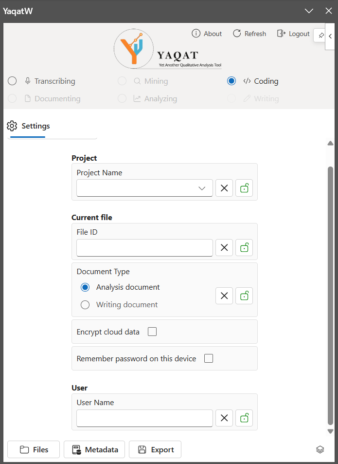

5. **Cloud Sync** (optional, but recommended)
   - Choose a provider: Google Drive™, Dropbox, OneDrive, Nextcloud, or Amazon S3 (and S3-compatible storage).
   - Click **Sync now** and follow the sign-in prompts.
   - YaqatW creates a folder called `YaqatW-DATA` in your cloud account and stores your project data there, both as a backup and so you can pick up the same project on another device.

   >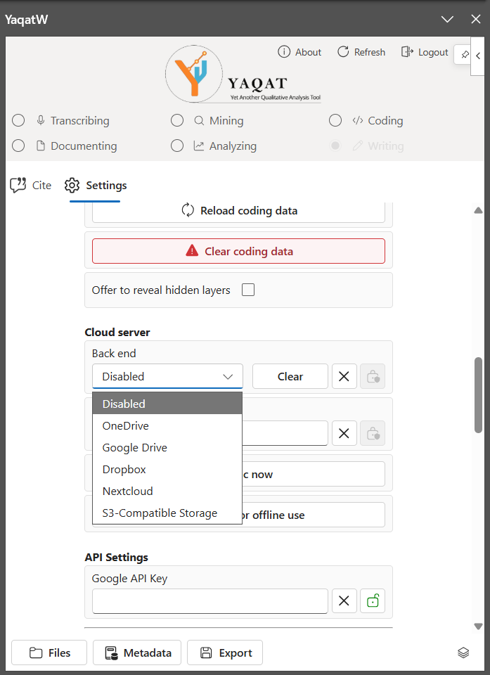

**Once these fields are filled in, the rest of the feature tabs unlock.** Until then, only Settings is available. This is deliberate, so that nothing you create ends up unattached to a project.

---

## Document Types

Before you choose a mode, it helps to tell YaqatW what kind of document you are looking at. You set this in **Settings → Document Type**, and your choice decides which modes are even offered to you. There are two types:

- **Analysis document** (the default). This is your raw material: the interview, the transcript, the source text you are going to code and analyze. For an Analysis document, **all six modes are available.**

- **Writing document.** This is the thing you are *producing*: a manuscript, a report, a chapter you are drafting from data you have already coded. For a Writing document, only **Writing, Analyzing, Mining, and Documenting** are available. Coding and Transcribing are deliberately hidden, so you cannot accidentally start coding your own manuscript.

There is one rule worth knowing: **you can only switch a document to Writing type if it has no highlights.** This keeps your coded source data and your written output cleanly separated. The typical arrangement is one or several Analysis documents holding your interviews and sources, plus a separate Writing document for your paper, all sharing the same project name so the writing document can reach back into the coded data.

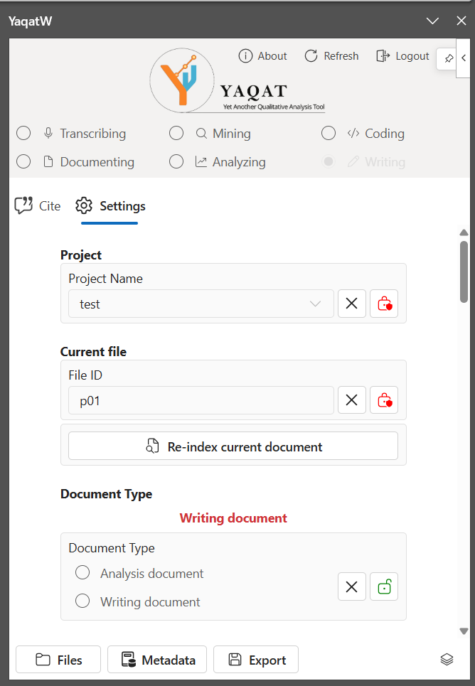

---

## Modes & Features

As described earlier, YaqatW is organized into six modes, and a mode is just a different view of the same project; your data does not move or change when you switch. You change mode from the **pinned header bar at the top**. If the header is hidden, click the **pin** to show and pin it. Which modes appear depends on the [document type](#document-types) you set.

Here is the whole map at a glance:

| Mode | Tabs | What it is for |
|---|---|---|
| **Coding** | Codes · Categories · Relationships | Coding source text, then organizing those codes into categories and relationships |
| **Mining** | Search · Frequency · Co-occurrence · Stats | Exploring the raw text: searching, word frequency, collocation networks, corpus statistics |
| **Analyzing** | Analysis | Cross-tabulating codes, categories, metadata, and search groups as variables |
| **Documenting** | Artifacts · Notes | Cataloguing evidence files and writing analytic memos |
| **Writing** | Cite | Drafting a manuscript with quotes, citations, figures, and tables drawn from your project |
| **Transcribing** | Import · Transcribe · Diarize | Turning audio recordings into speaker-labelled, time-stamped text |

*(Every mode also has a **Settings** tab; the table leaves it out to keep things short.)*

The rest of this section takes each mode in turn and explains it properly.

---

### Coding Mode

**What it is for:** turning raw source text into coded data: creating codes, applying them to passages, and organizing those codes into categories and relationships.

This is the heart of the add-in, so let me set out the vocabulary first, because the rest only makes sense once these three words are clear.

A **code** is a label you invent for a concept you care about: "Leadership," "Frustration," "Turning point." A **highlight** is what you get when you apply a code to a passage of text: a colored span in the Word document that carries one or more codes, plus an optional note and translation. The act of coding, then, is reading your document and turning meaningful passages into highlights.

One distinction is worth holding onto: **codes, categories, and relationships are shared across every file in the project**, while **highlights belong to the individual file.** In practice this means a code you create while working on `interview-001` is immediately available when you open `interview-002` under the same project, but the passages you highlighted in `interview-001` stay with `interview-001`.

> Coding mode is available only for **Analysis documents**. It is hidden for Writing documents, which by definition have no highlights.

#### The **Codes** Tab: Mark Up Your Text

**What it does:** lets you create codes and apply them to selections in your document.

**Creating a code:**

1. Click the **Codes** tab.
2. Click **New Code** (the **+** button).
3. Fill in:
   - **Code Name** (e.g. "Leadership")
   - **Description** (e.g. "Instances where a leader emerges or asserts authority")
   - **Color.** Pick from the palette; the color is what you will see in the document, so choose something distinct.
4. Click **Create**.

**Applying a code to text:**

1. Select an excerpt in your Word document.
2. Right-click the code in the list and choose **Use code**, or **Use code with comment** if you want to attach a comment in the same step.
3. The selected text is now highlighted in the code's color and labelled with the code name.
4. Click any coded passage in the document and its **info panel** opens. From there you can edit the passage, add notes and a translation, and then **save & close**.

**Viewing and finding codes:**

- Switch the code list between **Grid**, **List**, and **Compact** views, whichever suits the pane width and the number of codes you have.
- Use the **search** box to filter codes by name when the list grows long.

**Editing and deleting:**

- **Edit** changes a code's name, description, or color.
- **Delete** removes the code *definition*. Importantly, this does not remove the highlights already in your document; those stay. And a deleted code is not gone for good: it lands in the **Trash**, from where you can restore it.

**Working with a single highlight:** A passage can carry **more than one code at a time**: apply additional codes to the same selection, or **detach** a code you applied by mistake. Selecting a highlight opens its info panel, where you can see and edit:

- the **highlighted text** itself,
- a **translation** (translate on demand when an AI or translation provider is configured; see [AI & Translation](#ai--translation)),
- a free-text **note**, and
- the list of **codes applied** to that passage.

**Layers:** Highlights live in **layers**, and layers are how you keep parallel passes of coding from colliding. For instance, you might keep an original-language layer and a separate **translation layer**, or a first-pass and a second-pass round of coding. You can **create a new layer** and **show or hide layers independently**. Hidden layers stay hidden by default; if you would like YaqatW to offer to reveal a hidden layer when you click a highlight that lives in one, turn on *Offer to reveal hidden layers* in Settings.

**Exporting your coding work:** From the Codes footer you can export both the **code book** (your codes and their definitions) and the **coded data** (the highlights, with their codes, notes, and translations) as Word, Excel, HTML, JSON, or CSV. The details are in [Export & Analysis](#export--analysis).

**Importing comments as codes:** If your document already carries Word review comments, YaqatW can turn them into codes, each comment becoming a code applied to the text it was attached to. This is useful if you have already done a first pass of commenting in Word and do not want to redo it.

The **Import comments** button appears inside the **Add/Edit code** dialog, and **only when the document actually contains comments**, so if you do not see it, that is why. Open the dialog, click **Import comments**, and choose how each comment should map to a code:

- **First sentence → code name, the rest → description.** Best when your comments are short.
- **Split on a delimiter.** Structure each comment as `code <delimiter> description`, using a colon, a line break, or a custom delimiter; the text before the delimiter becomes the code, the text after becomes the description.
- **Labeled sections.** Mark the parts explicitly: `[Code]` …the code… `[Description]` …the description…

Before you confirm, a live preview tells you how many comments will become new codes, how many will simply be applied, and how many will be skipped. (For example, a comment that just reads "My interesting note" becomes a code of that name on the commented passage.)

**AI assistance for coding (optional):** When an AI provider is configured (see [AI & Translation](#ai--translation)), the **Add/Edit code** dialog offers **two distinct AI tools**. They differ in *what they read*: **Suggest** looks only at the passage you have selected, while **Agent** reads the whole document. Neither applies anything automatically — every suggestion is shown first, so you can accept, edit, or reject each one.

- **Suggest** (the button beside the Code Name field) is the quick option. With a passage selected in the document, one click on a provider returns a short list of candidate codes — relevant **existing** codes plus a few **new** ones — for that single selection. There is nothing to configure; use it when you want a fast second opinion on one highlight.
- **Agent** (the button in the dialog's footer) reads the **entire current document**, not your selection. It splits the text into passages — detecting interview turns and (optionally) separating interviewer from interviewee, or falling back to raw paragraphs — then proposes codes for **multiple passages at once**. When you accept a suggestion, it locates that passage back in the document (matching the text exactly, or by close approximation) and applies the codes there. Instead of writing prompts from scratch, you steer it with a few choices:
  - **Reasoning mode.** *Inductive* (build patterns up from the data), *Deductive* (test predictions from existing theory), or *Abductive* (match to your existing codes first, and let new ones emerge where nothing fits).
  - **Analytic stance.** *Descriptive*, *Interpretive*, *Critical*, or *Comparative*.
  - A **research question** and a free-text **prompt** to focus the AI's attention.
  - Options to embed and validate against your existing codes, include interviewer passages as context only, cap how many new codes the AI may propose, and output codes in your writing language.

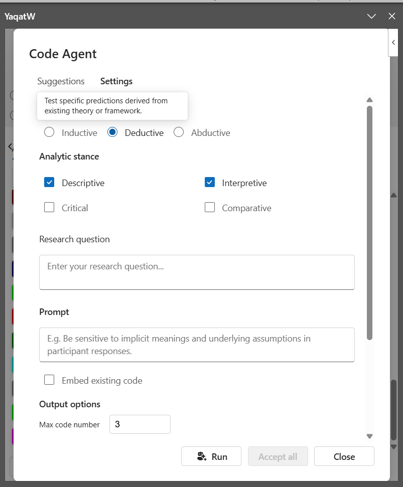

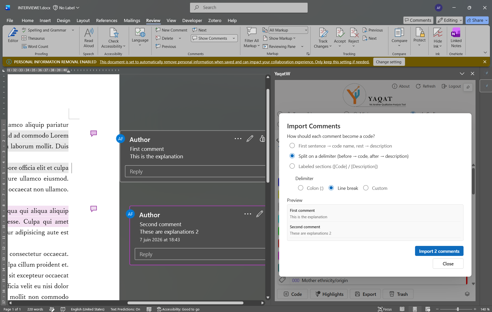


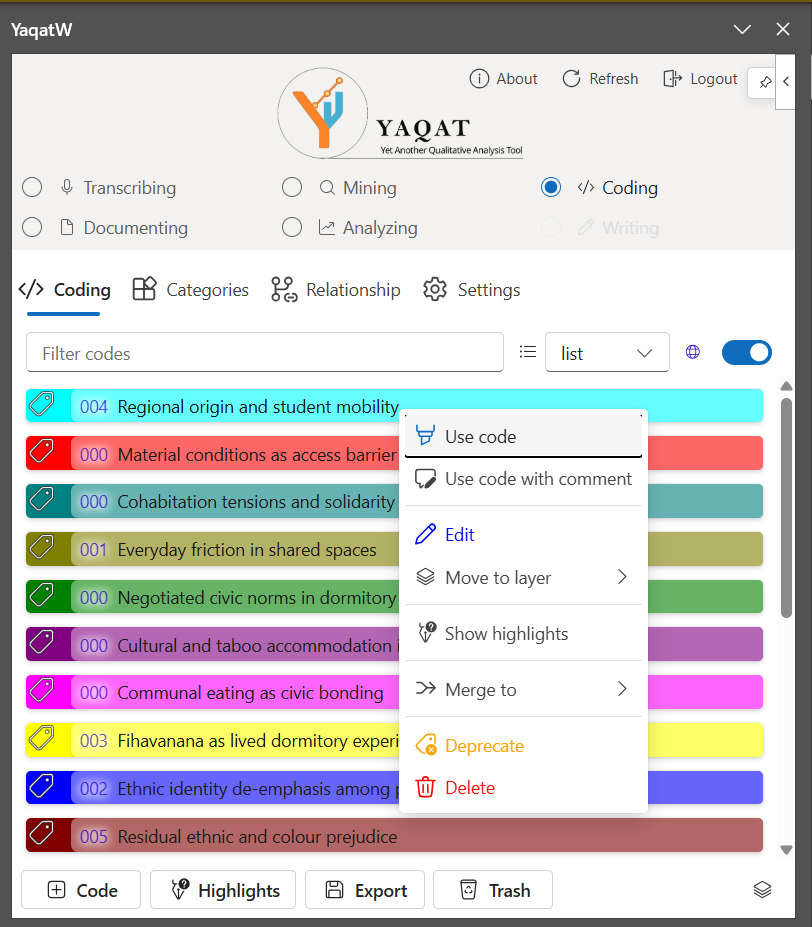

#### The **Categories** Tab: Organize Your Codes

**What it does:** groups related codes into categories, building a hierarchy of concepts on top of your flat list of codes.

The interface here looks a little different from the Codes tab, but it is straightforward.

**Creating a category:**

1. Click the **Categories** tab.
2. Click **New Category** (the **+** button).
3. Enter a **Category Name** and, if you like, a **Description**.
4. Click **Create**.

**Adding codes to a category:**

1. Open the category (or right-click it).
2. Choose **Add Codes to Category**.
3. Tick the codes you want and confirm.

Repeat until every code that belongs to the category has been added. You can expand and collapse categories with the arrow icon to keep the tree tidy.

**An example of what you are building:**

```
Leadership (Category)
├── Delegating Authority (Code)
├── Decision Making (Code)
└── Team Motivation (Code)

Communication (Category)
├── Active Listening (Code)
└── Feedback Delivery (Code)
```

Categories can be nested. You may choose to have a certain categories as Research Questions (RQ) for example and insert each related theme into each RQ. See the figure below. You have the item "Add child category" in context menu but you may also drag and drop one category onto another.

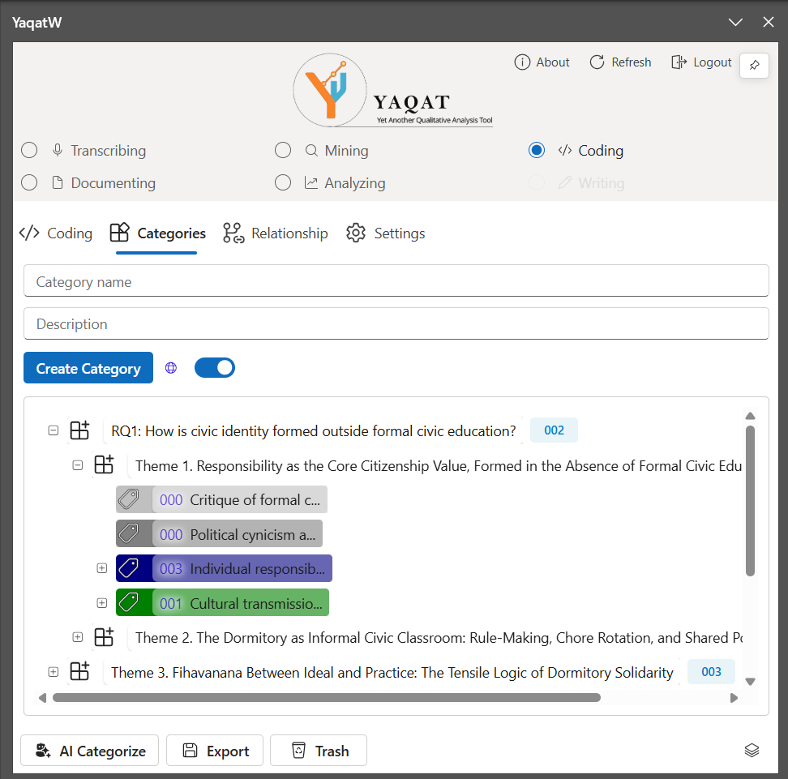

**Why bother:** After coding a document you may have twenty or more codes, which is a lot to reason about. Grouping them by theme (Behaviors, Attitudes, Outcomes, and so on) gives you a smaller number of larger ideas to analyze and report against. Grouping them further may allow you a higher level of abstraction.

#### The **Relationships** Tab: Document Connections Between Concepts

**What it does:** records *how* concepts connect (cause and effect, before and after, part and whole) rather than only what concepts exist.

Relationships behave a little differently from categories, and the difference is the useful part. A relationship is a **type** (for example, "Cause → Effect"), and within that type you create **instances**: concrete examples of that relationship found in your data. So one relationship type can hold many instances.

**Creating a relationship:**

1. Click the **Relationships** tab.
2. Click **New Relationship** (the **+** button).
3. Name the **Relationship Type** and click **Create**. One Instance is created for you automatically.

**Some relationship types you might use:** Cause → Effect · Then → Now · Example → General · Part Of · Precedes · Contradicts.

**Adding codes or categories to a relationship:**

1. Open the relationship to expand it.
2. On an Instance, choose **Add Code/Category** for each side of the relationship.
3. Relationships work best with categories, but you can add individual codes too.

**Adding more instances:** to record another concrete example of the same relationship type, just add another Instance.

**An example:**

```
Relationship: Cause → Effect
├── Instance 1
│   ├── Organizational Stress (Category)
│   └── High Turnover (Category)
└── Instance 2
    ├── Leadership Issues (Category)
    └── Team Morale (Category)
```

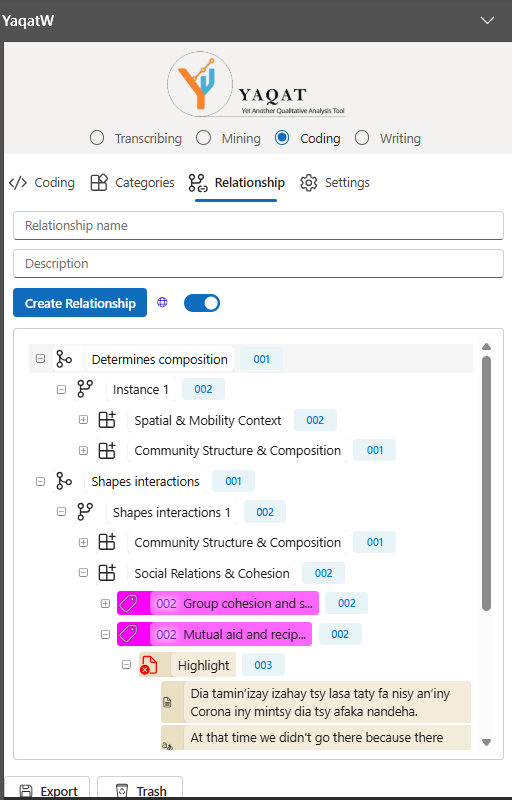

**When to reach for a relationship:** A category captures *what contains what*, the hierarchy you build by nesting. A relationship captures something a category cannot: a *directional, typed connection* between concepts (Cause → Effect, Precedes, Contradicts). Use one when the question is *how two ideas connect*, not *which group they belong to*. Relationships can also be nested, so you can build layered structures of connected concepts when an analysis needs the extra depth.

---

### Mining Mode

**What it is for:** getting to know the raw text itself: searching it, measuring word frequency, mapping which words travel together, and profiling who said what, before, during, or after you code.

To do any of this, Mining first has to read your document into something it can analyze. It does this by parsing the text into **turns**, and it is worth understanding how, because the cleaner your document, the cleaner the analysis.

YaqatW treats **each paragraph as one potential speaker turn**. A paragraph counts as a turn if it contains a colon: the text *before* the colon is taken as the speaker label (normalized to uppercase internally for matching — you can type names in any case, and scripts without uppercase/lowercase such as Chinese, Japanese, or Arabic are kept exactly as written), and the text *after* it is the spoken content. The speaker is then classified as an **interviewer** or an **interviewee** by checking the label against a list of known interviewer names (you can extend that list through document metadata). A trailing timestamp in the form `[HH:MM:SS]` is recognized and stored too. So a paragraph like:

```
INTERVIEWER: What happened next? [00:04:12]
```

is read as an interviewer turn, with the timestamp pulled out automatically.

What if your document is not a transcript at all, just prose with no speaker labels? YaqatW notices: if fewer than about a third of the paragraphs look like turns, it concludes the document is plain text and treats the whole thing as a single speaker called `SOURCE`, one turn per paragraph. Either way, Mining ends up with a clean list of turns to work on, which is why **keeping one speaker turn per paragraph** (see [Transcribing](#transcribing-mode)) makes everything downstream tidier.

The current document is indexed automatically when you open it. If results ever look stale, use **Settings → Re-index current document** to rebuild the index.

**How Mining reads your words — tokenizing, language, and stopwords.** Once Mining has its list of turns, it breaks each turn into individual **words (tokens)** so it can count and compare them, and *how* it splits depends on the language. For Roman-script languages it splits on letters while preserving accents (so Malagasy *tanana* and *tanàna* stay distinct), keeps English contractions together (*don't* stays one word), and strips French elisions (*l'école* becomes *école*). For languages written without spaces between words — **Japanese, Chinese, and Korean** — it uses the system word segmenter instead; Japanese can additionally load a dictionary for finer, grammar-aware splitting (this is the "Japanese dictionary" that **Prepare for offline use** caches).

How does Mining know which language's rules to apply? Either you tell it, through **Settings → General → Data language**, or it **auto-detects** from a sample of your text. A small badge beneath the results shows the language in use and flags when it was guessed, so if the guess is wrong you can pin it in Settings. Tokenizing and stopwords are tuned for six languages — **Malagasy, English, French, Japanese, Chinese, and Korean** — and the Data language list offers those plus two generic choices for everything else: **Roman / Latin script** (for untuned Latin-alphabet languages like Spanish or German) and **Universal / Other script** (a catch-all that segments any writing system, including Cyrillic, Greek, Arabic, and even space-less scripts such as Thai; it works on Latin text too, so pick it if you are unsure). The generics tokenize correctly but have no built-in stopword lists.

**Stopwords** are the very common function words, *the, and, is, of, a* and their equivalents, that appear everywhere and would otherwise dominate every frequency list and co-occurrence map without telling you anything. The **Filter stopwords** switch (on by default in Frequency and Co-occurrence) drops them. Built-in stopword lists currently ship for **Malagasy, English, and Japanese**; for other languages the list is empty, so the switch has nothing to remove — but the **Excluded words** field lets you add your own words to ignore, in any language.

For longer or reusable exclusion lists, the Frequency and Co-occurrence tabs also let you keep **filter files** instead of retyping words into the field. A filter file is a plain `.txt` list with **one word per line** (blank lines are ignored, matching is case-insensitive), stored in your project under `__filters__`. From the **Filters** dropdown you can tick one or more files to apply them — their words are merged on top of whatever is in the Excluded words field. You can build a filter file three ways: **Create new filter** to make an empty one and edit it in place, **Generate with AI…** to have YaqatW propose a list from the words currently on screen, or **upload an existing `.txt` file** — open the **File Explorer** (the folder icon next to a file, or Settings → file tools), navigate to the project's `__filters__` folder, and use **Upload File**; it then appears in the Filters dropdown ready to tick.


**A shared layout.** The four analysis tabs — Search, Frequency, Co-occurrence, and Stats — all follow the same pattern. The main area shows your results, and a **Settings** button at the top opens a dialog of sub-tabs holding that tab's controls; the results stay visible behind it, so a change previews immediately. Two things you will meet in nearly every Settings dialog:

- **Data (scope).** The **Data** sub-tab is where you decide how wide to cast your net: **Global** (analyze every indexed file in the project, not just the document in front of you), specific **Files** (all of them by default), or specific **Speakers**.
- **Role.** Most tabs let you restrict the analysis to **All / Interviewer / Interviewee** turns (under the Analysis sub-tab, or as a built-in filter).

Every tab also has its own **Export / Export All** footer.

#### The **Search** Tab: Full-Text Exploration

**What it does:** searches across your text to find passages and patterns. The search box sits at the top; everything else — which mode to use, the scope, how results are displayed, and translation — lives in the **Settings** dialog, under the **Search mode**, **Data**, **Display**, and **Translation** sub-tabs. There are seven search modes, ranging from a plain substring to fairly advanced queries:

| Mode | What it does |
|---|---|
| **Exact** | Matches the exact substring you type |
| **Wildcard** | `*` stands for any characters; e.g. `saka*` matches `sakafo`, `sakafoana` |
| **Boolean** | `AND`, `OR`, `NOT`, and quoted phrases; e.g. `sakafo AND ankizy NOT vary` |
| **Proximity** | `NEAR/N` or `BEFORE/N`; e.g. `sakafo NEAR/5 ankizy` finds the two words within five tokens of each other |
| **Fuzzy** | Matches approximate spellings and morphological variants |
| **Regex** | A full JavaScript regular expression, for when you need precise control |
| **Named** | A YAML file defining named groups of search terms (see below) |

Two modes have their own tuning controls in the Search-mode sub-tab. **Fuzzy** exposes a **min score** (how good a match must be to appear), a **threshold** (how loose the fuzzy matching is overall), and a **minimum match length** in characters. **Named** lets you match **per sentence** rather than per whole turn, and offers the Exclusion setting described below.

**Display options** (Display sub-tab) let you show, on each result, the full speaker turn, the speaker's name, their role, the match score, the turn number, and selected metadata fields. Click any result to jump straight to that location in your document.

**Named search** deserves a closer look, because it is the most powerful mode for theory-driven work. You define groups and subgroups of search terms in a YAML file, then control how matches are deduplicated with the **Exclusion** setting:

- **None** (the default). Every match is reported: if one turn matches two different groups, you get two results.
- **Exclude turn.** Once a turn matches any subgroup, it is set aside and not counted again for the remaining subgroups. Each turn appears at most once across all results.
- **Exclude subgroup.** Once a subgroup has captured a match anywhere, that subgroup stops searching. Each subgroup captures at most one turn in total.

The right choice depends on whether you want exhaustive coverage (None) or a clean, non-overlapping tally (the Exclude options).

**The YAML file** is a simple two-level outline: each top-level key is a **group**, each key under it is a **subgroup**, and each subgroup holds a **list of terms**. Indentation (two spaces) is what creates the nesting, and terms are introduced with `-`. You do not declare what *kind* of term each line is — YaqatW **auto-detects** the type from its syntax, so you can freely mix exact phrases, wildcards, regular expressions, boolean queries, and proximity rules inside the same subgroup:

```yaml
# Named search file — yaqatw
# Structure:  Group:  ->  Subgroup:  ->  - term, - term, ...
# The type of each term is detected automatically from its syntax.

Emotion:                           # group
  Stress:                          # subgroup
    - stress                       # exact match (case-insensitive)
    - too much pressure            #   …phrases work too
    - anxi*                        # wildcard: * = run of non-space chars (anxious, anxiety)
    - burn**out                    #   ** = any characters, incl. spaces (burnt out, burn-out)
    - /over\s*whelm\w*/i           # regex: /pattern/flags  (defaults to i)
  Relief:
    - relax
    - /calm(ed|ing)?/i

Work:
  Difficulty:
    - ~bool deadline AND impossible          # boolean: AND / OR / NOT
    - ~bool overtime OR weekend
    - ~bool "long hours" OR understaffed      #   "quoted" = exact phrase
    - ~bool workload NOT manageable
    - ~near/5 deadline >> missed              # proximity: within 5 tokens, any order
    - /can(no|')t\s+cope\w*/i

Family life:                       # group and subgroup names may contain spaces
  Moving away:                     #   (no quotes needed)
    - left home
    - ~before/3 moved >> city                 # termA before termB, within 3 tokens
    - ~after/3 came >> back                   # termA after termB, within 3 tokens
    - ~notnear/5 family >> support            # termA present, termB NOT within 5 tokens
    - relocat*
```

Term-syntax reference:

| Write it like… | Detected as | Notes |
|---|---|---|
| `too much pressure` | **Exact** | Plain text, case-insensitive (the fallback when nothing else matches). |
| `anxi*` | **Wildcard** | `*` matches a run of non-space characters; `**` matches anything, spaces included. |
| `/over\s*whelm\w*/i` | **Regex** | `/pattern/flags`; flags are optional and default to `i` (case-insensitive). Escape backslashes as in the examples. |
| `~bool deadline AND impossible` | **Boolean** | `AND` / `OR` / `NOT`, plus `"quoted phrases"`. |
| `~near/N a >> b` | **Proximity** | `a` and `b` within `N` tokens, in any order. |
| `~before/N a >> b` | **Proximity** | `a` occurs before `b`, within `N` tokens. |
| `~after/N a >> b` | **Proximity** | `a` occurs after `b`, within `N` tokens. |
| `~notnear/N a >> b` | **Proximity** | `a` is present but `b` is *not* within `N` tokens. |

The proximity separator `>>` is canonical; `<<`, `>`, and `<` are also accepted. If a `/regex/` or `~`-prefixed line is malformed, YaqatW quietly falls back to treating it as an exact phrase rather than failing the whole file.


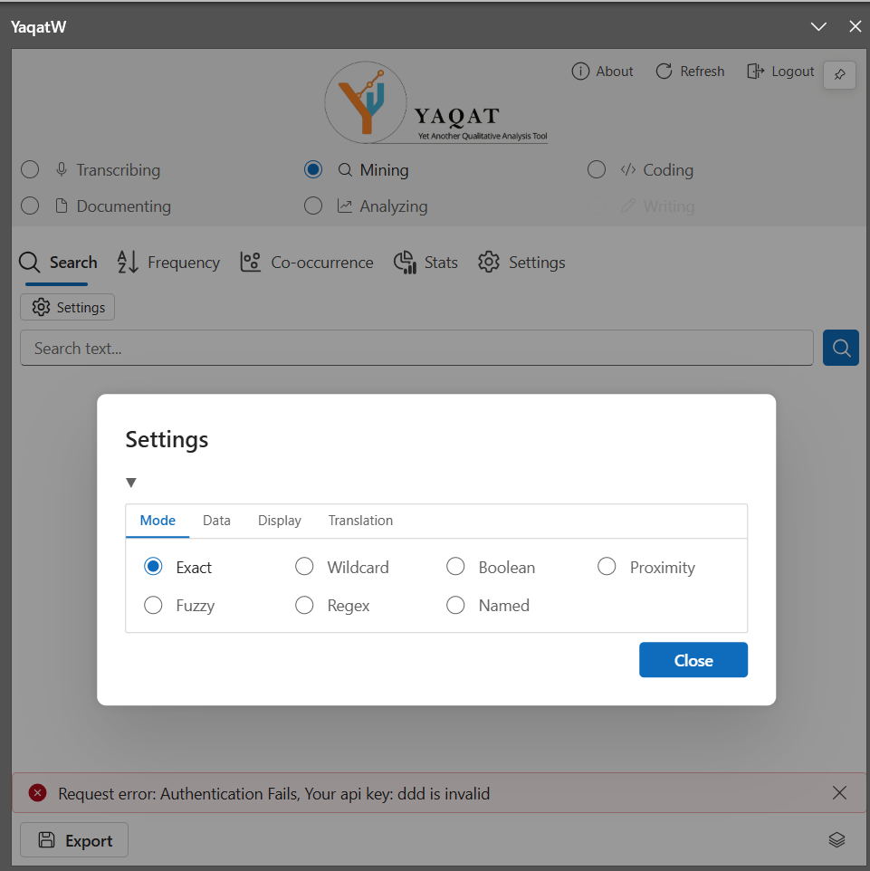

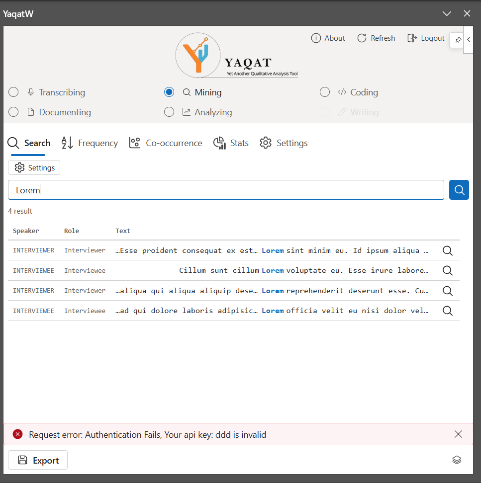

#### The **Frequency** Tab: Word Frequency Analysis

**What it does:** counts the most frequent words (or word pairs, or triplets) in your text, so the dominant topics surface on their own.

**Options.** All of the controls live behind the **Settings** button at the top of the tab, which opens a dialog organised into five sub-tabs. The results table (or word cloud) stays visible behind the dialog, so you can adjust a setting and see the effect immediately.

- **Data.** Choose the scope (which files/speakers feed the count — see the [scope bar](#mining-mode) explanation) and, optionally, **Split by** a metadata field so the results can be broken down group by group.
- **Analysis.**
  - **Role.** Restrict to All / Interviewer / Interviewee turns.
  - **N-gram.** Count single words, consecutive pairs (bigrams), or triplets (trigrams).
- **Filter.**
  - **Min frequency.** Hide anything appearing fewer than N times, to cut down on noise.
  - **Hapax.** Show only the words that appear exactly once (the *hapax legomena*), which can be revealing in their own way.
  - **Filter stopwords.** Drop common function words (pronouns, prepositions, fillers) that would otherwise dominate the list without telling you anything. On by default; see [tokenizing, language, and stopwords](#mining-mode) above for which languages have built-in lists.
  - **Excluded words.** A comma-separated list of your own words to drop from the results, in any language, on top of the stopword filter. For longer or reusable lists, use the **Filters** dropdown below the field to apply **filter files** (`.txt`, one word per line) — created here, generated with AI, or uploaded through the File Explorer. See [Mining mode](#mining-mode) for details.
- **Display.** Switch between a frequency **table** and a **word cloud**. When the cloud is on, this tab also exposes its scaling (linear / sqrt / log), maximum word count, renderer (SVG / Canvas), decorative-vs-analytical colours, rotation, and export quality, plus buttons to open the cloud in its own window or export it to PNG / SVG. If you set a **Split by** field, a **Show by …** button renders one cloud per group.
- **Translation.** Map raw words to a preferred display form so variants are merged and relabelled in the output (handy for normalising spellings or translating terms for a report).

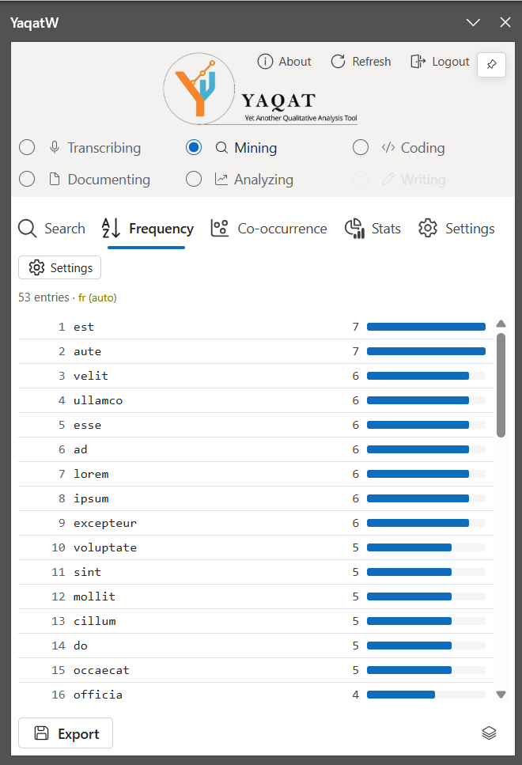

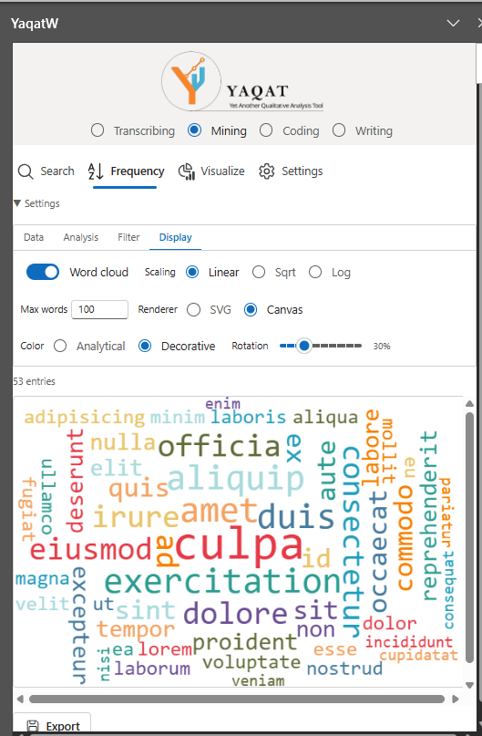

**Why it helps:** It tells you what your data is "about" before you have read every word of it. If "stress" appears 47 times and "deadline" 28 times, those are very likely to be major themes, and now you know to watch for them as you code.

#### The **Co-occurrence** Tab: Word Networks

**What it does:** finds which words tend to appear near each other (their *collocates*) and draws them as a network you can read at a glance.

**Target word(s).** Type one or more words in the box at the top — separate several with `|`, e.g. `build | home | country` — and press **Plot**. Leave it empty to map the most frequent word pairs in the whole selection. The rest of the controls live in the **Settings** dialog:

- **Data.** Scope and **Split by** a metadata field (renders one map per group).
- **Analysis.**
  - **Window.** How many tokens to scan to the left and right of the target word.
  - **Role.** Restrict to All / Interviewer / Interviewee turns.
- **Filter.** **Filter stopwords**, **Min frequency** and **Max results** (to keep the network from becoming an unreadable hairball), plus the same **Excluded words** field and **filter files** as the Frequency tab.
- **Display.** Toggle between a ranked **table** and the network **Map**. With the map on, you also get:
  - **Layout.** Force, Radial, Circular, Clustered, or Tree.
  - **Nodes.** How many of the top pairs to draw.
  - **Edge style.** Straight Line or Curve, with adjustable **edge thickness** and a linear or log thickness **scale**.
  - **Decorative vs analytical** coloring.
  - **Tree levels** (Tree layout) and **cross-edge style** for cross-community / cross-branch links — gray, dashed, dotted, or hidden (Clustered and Tree layouts).
  - **Quality** for exported images.
- **Translation.** Map raw words to a preferred display form, as in the Frequency tab.

Export the visible view to PNG, or use **Export full map** for the complete network; if you set a Split-by field, **Show by …** opens one map per group.

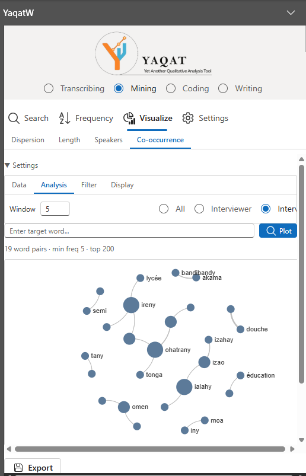

#### The **Stats** Tab: Corpus Statistics & Visualizations

**What it does:** gives you quantitative overviews of your text and your speakers. A small strip at the top of the tab switches between three views, each with its own **Settings** dialog (scope, role, and so on):

- **Dispersion.** Type the words you want to track, then **Plot**: you get a tick mark on every turn where each word appears. This shows you *where* in the data a word is used — clustered in one section, or spread evenly throughout. When several files are selected, turn on **Split by file** (Settings → Data) so each interview gets its own timeline rather than being mixed onto one misleading axis.
- **Length.** A histogram of turn lengths, bucketed in ten-token bands, so you can see whether people gave short answers or long ones. By default it counts interviewee turns only; **Include interviewer** (Settings) adds the interviewer's turns.
- **Speakers.** A table with, per speaker: number of turns, average turn length, vocabulary size, and Type-Token Ratio (a standard measure of lexical diversity).


**Why it helps:** the dispersion and length views tell you how your material is shaped, and the speaker statistics let you compare how much, and how diversely, each participant spoke. The word cloud (in the Frequency tab) and co-occurrence maps can be **saved as figures** and later inserted into a Writing document (see [Writing Mode](#writing-mode)), so the picture you make while exploring can go straight into your paper.

---

### Analyzing Mode

**What it is for:** asking structured questions of your coded data (*does this pattern differ by group?*) by treating your codes, categories, metadata, and search results as **variables** you can combine and compare, without exporting everything to a separate statistics package.

#### The **Analysis** Tab: Variable-Based Exploration

**What it does:** lets you build an analysis the way you would sketch out a small study. You pick what you are measuring, pick what might explain it, optionally pick how to break it down, and run it.

**The building blocks.** The left panel lists every **data item** in your project, grouped by kind, each marked with a colored badge:

| Badge | Kind | What it contributes |
|---|---|---|
| **C** | Code | A single code |
| **Ca** | Category | A group of codes |
| **R** | Relationship | A documented code/category connection |
| **H** | Highlight | An individual coded passage |
| **M** | Metadata | A document or participant metadata field |
| **Co** | Co-occurrence | A word-pair from Mining |
| **G** | Group | A named-search group |

**The three zones.** You drag items from the left panel into one of three zones on the right to frame your question:

- **Dependent.** What you want to measure or explain: the outcome, such as a code or category.
- **Independent.** The factor you suspect relates to it, such as another category or a co-occurrence.
- **Group by.** How to split the results into comparable groups, such as a metadata field like region or interview round.

**Running it.** Click **Run** to compute the result: counts and overlaps across the variables you placed. You can open the result in a dialog and export it. The layout adapts to the width of the pane (it switches between an accordion and a side-by-side view), and your last configuration is remembered, so you do not have to rebuild it each time.


**Hierarchy levels.** Because categories (and relationships) form a tree, each one appears in the data-items panel once per depth level, suffixed with a bracketed index: **Category [0]**, **Category [1]**, **Category [2]**, and so on. **[0] is the root**, the top theme an item rolls up to, and the index grows as you descend toward the leaves. Drop **Category [0]** into a zone to analyze at the broadest level, or a deeper one like **Category [2]** to break the same data down more finely. A flat project (no nesting) yields just **Category [0]**, equal to the category's own name.

**A concrete example:** put a category in *Dependent*, drop a metadata field like "Region" into *Group by*, and you will see how that category is distributed across regions. Or place two categories in *Dependent* and *Independent* to see how often they overlap in the data.

> Analyzing mode works for both Analysis and Writing documents, so you can interrogate your data even while you are drafting your paper.

---

### Documenting Mode

**What it is for:** keeping the evidence and the thinking that surround your text: the photos, recordings, and documents you collected in the field, plus the analytic memos you write as you make sense of it all.

The distinction from Coding is worth drawing clearly. Coding works on text *inside* the Word document. Documenting manages material that sits *alongside* it. It has two tabs, **Artifacts** (evidence files) and **Notes** (memos), and both are searchable and can be pulled into a Writing document through the [Cite](#writing-mode) tab.

#### The **Artifacts** Tab: Manage Evidence Files

**What it does:** catalogues evidential material that is not plain text (field photos, audio clips, scanned documents) together with where it came from and what you make of it.

**Each artifact records:**

- **Title** (required). A short identifying label.
- **Source.** Where it came from (a person, organization, archive, or URL).
- **Collected by.** Defaults to your user name.
- **Session.** An optional ID linking it to a fieldwork session or visit.
- **Tags.** Free-form keywords for filtering later.
- **Interpretation.** Your reading of what the artifact shows. This is the researcher's voice, kept distinct from the raw material.
- **Attachments.** The actual files (images, audio, documents).

> **Cloud required:** Artifact attachments are stored in your cloud provider's project folder, so you must configure a cloud backend in Settings before you add artifacts. Without one, attachments may be lost on a browser reset. And if the cloud provider is disconnected, existing attachments may be temporarily unreachable until you reconnect.

**Lifecycle and sync:** Artifact records sync with the rest of your project, while their attachments are uploaded to the project folder on your cloud provider. An artifact can be **deprecated** (kept on the record, with a reason) or **deleted** (marked deleted, and still recoverable). If an attachment cannot be found either locally or in the cloud (which can happen after you switch devices), YaqatW flags the **missing attachments** and lets you decide whether to keep or prune them. A saved artifact can later be inserted into a Writing document as an image with a caption and a source line.


#### The **Notes** Tab: Analytic Memos

**What it does:** lets you write and keep analytic notes and memos alongside your project. Like artifacts, notes can be searched and inserted into a Writing document through the Cite tab, so the thought you have while coding does not get lost before you write it up.


---

### Writing Mode

**What it is for:** drafting the manuscript itself (your paper, report, or chapter) by pulling already-coded evidence out of your project and into the page, correctly attributed, instead of copy-pasting and losing track of where each quote came from.

Writing mode is meant to run in its own **Writing document** (see [Document Types](#document-types)), kept under the same project name as your coded sources. That shared project name is what lets the writing document reach all of their highlights, notes, artifacts, figures, and tables.

#### The **Cite** Tab: Search and Insert Quotes, Citations, Figures & Tables

**What it does:** pulls material from anywhere in your project into the document you are drafting.

**What you can search and insert:**

- **Highlights.** Your coded passages, with their text, note, or translation.
- **Artifacts.** Inserted as an image with a caption and a source line.
- **Notes.** Your analytic memos.
- **Tables** and **Figures.** Saved tables, and the saved word clouds and co-occurrence maps from Mining.

**How to use it:**

1. Click the **Cite** tab and choose a source.
2. Search for codes, keywords, or passages.
3. Review the matches in context.
4. Insert at your cursor, choosing:
   - **Inline** or **Block** quote
   - **Linked (refreshable)** or **Unlinked (plain paste)**
   - **Plain text** or **Rich text**

**Why "linked" matters.** A **linked (refreshable)** citation stays connected to its source highlight or figure. If you later re-code a passage, fix a translation, or regenerate a word cloud, you can simply **refresh** the inserted citation instead of hunting it down and replacing it by hand. Choose **unlinked (plain paste)** when you want a one-off snapshot that will not change no matter what happens to the source. Both have their place: linked for living drafts, unlinked for final or quoted-verbatim material.

**Attribution.** Quotes are labelled with their source, typically the participant ID drawn from a metadata field. The formatting of all this (the quotation characters, the prefix and suffix around the participant label, and which metadata field supplies the participant ID) is configurable under **Settings → Appearance & Insertion**, as is how inserted images and tables are captioned, positioned, and aligned.

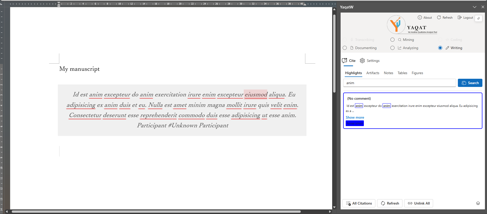

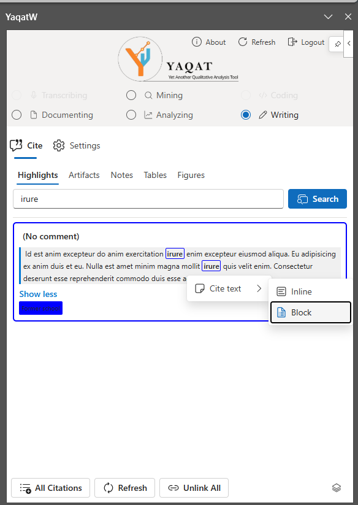

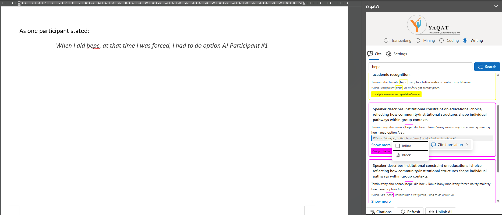

**In practice:** while writing your analysis, you search for the coded passages that support the argument you are making and insert them as properly attributed quotes, without copy-pasting and without losing track of which interview each one came from.

---

### Transcribing Mode

**What it is for:** producing the transcripts you will later code: playing back interview audio and typing it into Word with speaker labels and timestamps, helped along by keyboard shortcuts, voice enrollment, and automatic speaker detection.

> **A note of caution:** Transcribing mode is still experimental and under active development. The other modes are fully usable; here you should expect rough edges.

The work runs across three tabs: you **Import** the audio, **Transcribe** it turn by turn, and optionally **Diarize** it to detect who spoke when across the whole recording. The lines you insert land in the Word document as one speaker turn per paragraph, which is also the shape that [Mining](#mining-mode) expects.

> Like Coding, Transcribing is available only for **Analysis documents**.

#### The **Import** Tab: Load Audio Files

**What it does:** adds and previews an audio file for transcription.

1. Click the **Import** tab.
2. Choose a file or drag and drop it in.
3. Supported formats include MP3, WAV, OGG, M4A, FLAC, and other Web Audio formats.
4. The file's metadata (type, size, duration) is shown so you can confirm you have the right file.
5. Move to the **Transcribe** tab to begin.

> Transcription and audio features need system-level file storage to work. On macOS this means Ventura 13 or later. If your system cannot store audio, YaqatW will warn you rather than fail silently.

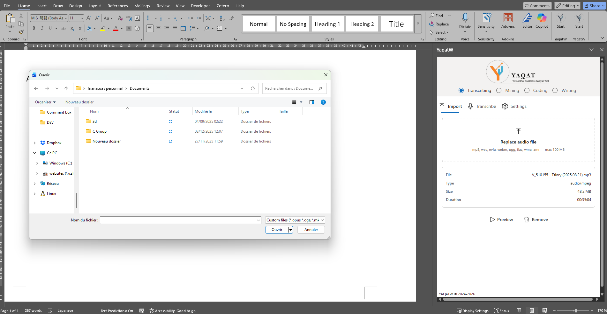

#### The **Transcribe** Tab: Playback, Transcription & Speaker Enrollment

**What it does:** lets you transcribe audio with customizable keyboard shortcuts, a waveform display, speaker management, and optional AI transcription of segments you mark.

**Playback controls:** Play/Pause · Stop · Seek Back (−5s) · Seek Forward (+5s) · Speed control (0.5×–2.0×). You can toggle **real waveform peaks** in Settings to visualize the actual audio (it is cached so performance stays reasonable).

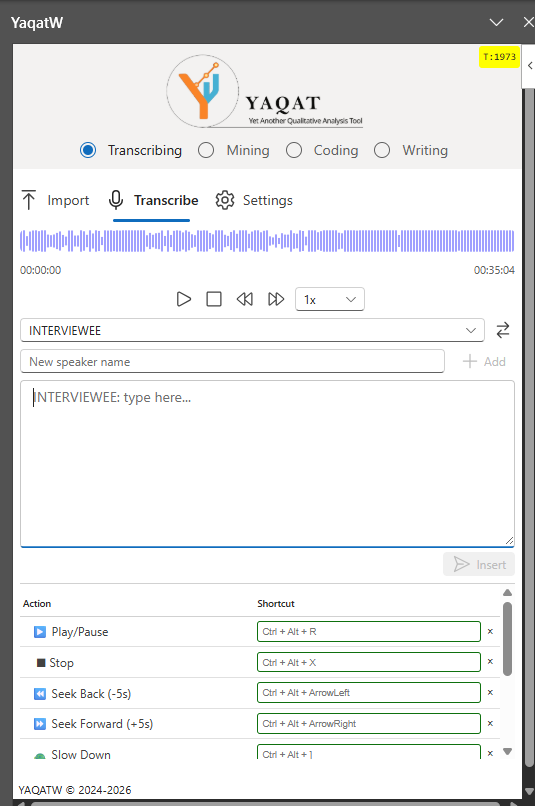

**Managing speakers:**

1. Type a name in the "New speaker name" field and click **Add**.
2. Switch the active speaker from the dropdown, or with the **Switch Speaker** shortcut.
3. Every transcribed line is tagged with the active speaker and a timestamp.

**Marking a segment and transcribing it with AI:** Mark a **start** and an **end** on the timeline, then either **Transcribe** that segment with your configured transcription provider, or **Enroll Speaker** to teach YaqatW that speaker's voice from the segment. Enrollment is what makes automatic speaker identification and diarization possible later.


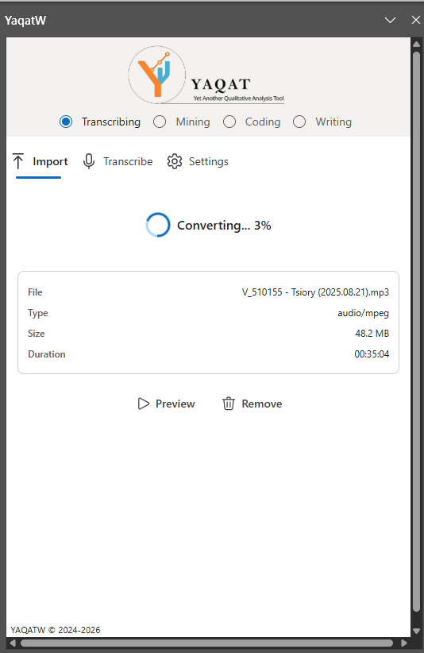

**Keyboard shortcuts (all customizable):** shortcuts use `Ctrl+Alt+Key`.

| Action | Default Key |
|--------|-------------|
| Play/Pause | R |
| Stop | X |
| Seek Back / Forward | ← / → |
| Slow Down / Normal / Speed Up | [ / \\ / ] |
| Insert Timestamp | Enter |
| Switch Speaker | T |
| Mark Start / Mark End | (set your own) |

To rebind a shortcut, click its cell in the table and press `Ctrl+Alt` plus your chosen key (green means saved, red means invalid, and × clears it).

**The transcription workflow, step by step:**

1. Play and listen; pause, or type live as you go.
2. Insert timestamps where you want them.
3. Type your transcription and click **Insert** to add the line to Word with its speaker label and timestamp.
4. Switch speakers and carry on.

**A tip:** Use **Enter** to insert (it does the same thing as the Insert button) and **Shift+Enter** for a line break within a note. Keeping one speaker turn per paragraph helps the Mining parser detect turns correctly later; it is the same convention described back in [Mining Mode](#mining-mode).

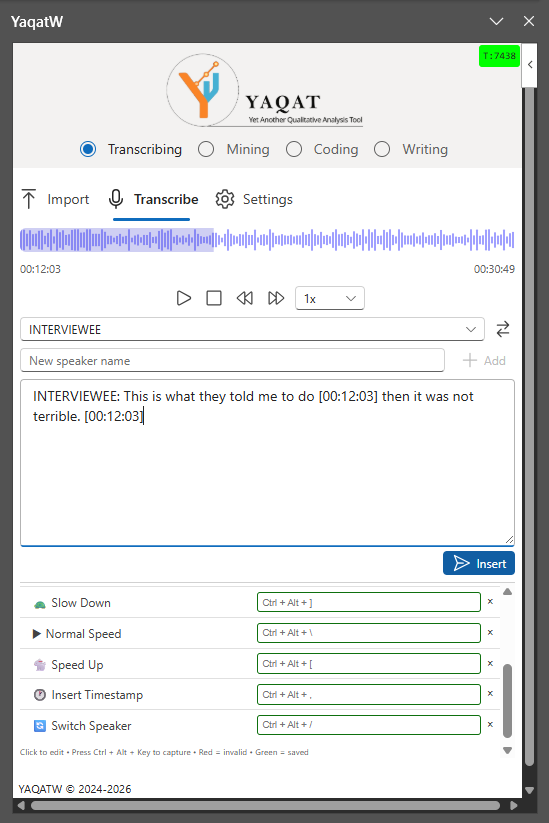

#### The **Diarize** Tab: Automatic Speaker Diarization

**What it does:** automatically works out *who spoke when* across the whole recording, and lays it out as an editable timeline. "Diarization" is just the technical word for that who-spoke-when segmentation.

**How to use it:**

1. First, enroll at least one speaker on the **Transcribe** tab; diarization needs a voice to recognize.
2. On the **Diarize** tab, click **Analyze**. YaqatW decodes the audio, extracts voice features, clusters the unknown voices, and merges the result into a timeline.
3. Edit the timeline directly: select a segment to **split** it at the playhead, **merge** it with the next one, **delete** it, **assign** it to a speaker, or **rename** speakers.
4. Zoom in and out, undo and redo, and **export** the diarization as JSON.


**Engines and the remote option:** You choose a speaker-identification engine in Settings: **DIY MFCC** (offline and free) or **Picovoice Eagle** (more accurate, and needing a free Picovoice AccessKey). For heavier recordings, a **Remote** analyze option can hand the diarization off to a companion app; you set its URL and API key in Settings.

---

### Settings (All Modes)

#### The **Settings** Tab: Configuration, Metadata & Cloud Sync

**What it does:** this is where you manage everything that is not a mode in itself: project setup, encryption, cloud connections, AI and translation providers, document metadata, transcription, and appearance. It is present in every mode. Here is each section:

1. **Document Type.** Analysis document (all modes) or Writing document (Writing / Analyzing / Mining / Documenting). Switching to Writing requires zero highlights. See [Document Types](#document-types).
2. **Operating Mode (yaqatw-mode).** Coding, Mining, Analyzing, Documenting, Writing, or Transcribing. Your data persists across modes.
3. **Project.** The **Project Name**, shared across all files in the project.
4. **Current File.** The **File ID** for this document, plus **Re-index current document** to refresh the Mining and Analysis index.
5. **Encryption** (appears once a Project Name is set)
   - **Data Password** + **Confirm.** Encrypts sensitive data.
   - **Encrypt cloud data.** Turns on encryption when syncing.
   - **Remember password on this device.** Skips re-entry each session. Do **not** enable this on a shared machine; use **Logout** to clear it.
   - ⚠️ Losing your password makes encrypted data **permanently unrecoverable**, and disabling encryption does **not** decrypt data that was already encrypted.
6. **User.** Your **User Name**, used to track who made each edit.
7. **General.** **Data language** (the language of your source text — it sets which tokenizer and stopword list [Mining](#mining-mode) and Analyzing use, and the transcription language hint; the list is the six tuned languages plus the generic **Roman / Latin script** and **Universal / Other script** options, or leave it and Mining will auto-detect per document. Choosing a generic option tells transcription to auto-detect the spoken language), **Writing language** (the language the AI writes new codes and generated output in), and **UI language** (the add-in's own interface: English, Malagasy, or Japanese).
8. **Coding Data.** **Reload coding data** (pull the latest codes, categories, and relationships from all project files into this document) and **Clear coding data** (wipe and cleanly re-import, which fixes duplicates). There is also the option to **reveal hidden layers** when you select a highlight that lives in one.
9. **Cloud Server.** Choose a provider (see [Cloud Sync](#cloud-sync)), set the **Sync interval** (0 disables auto-sync), **Sync now**, and **Prepare for offline use** (this caches the app shell, Office.js, the Japanese dictionary, and the FFmpeg audio converter, so they load even without internet).
10. **API Settings.** Translation and AI provider keys and models (see [AI & Translation](#ai--translation)).
11. **Transcription.** Speaker-identification **engine** (DIY MFCC / Picovoice Eagle), **Companion Diarizer** URL and key, default **playback speed**, **timestamp format**, and **real waveform peaks**.
12. **Appearance & Insertion.** Quote styles, the participant label, and how inserted **images/figures** and **tables** are captioned, positioned, and aligned in Writing mode.

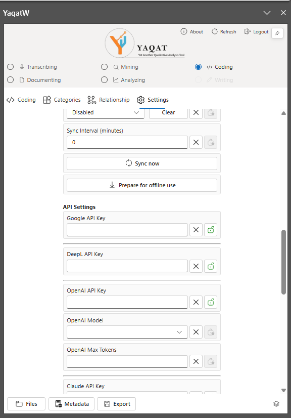

---

### Metadata, and a word about privacy

Metadata is structured information *about* the document, most often details about the participant, that you can attach to your exports. There are two ways to manage it, and I will describe both.

**The quick way: a table in the document.**

1. At the **very beginning of the document**, insert a **two-column table**. Make the first row a header: the first cell reads **Metadata**, the second reads **Value**.
2. Add one row per entry, for example `Participant | P-001`, `Region | Region A`.
3. Go to **Settings → Edit Metadata** and click **Refresh**. YaqatW reads the table and saves every row into the metadata database.
4. Whenever you add or change rows, click **Refresh** again. It refreshes automatically when the add-in opens, but a manual refresh is the way to be sure.

**The dialog way (direct editing and encryption):** In the same **Edit Metadata** dialog you can add or edit fields by hand, and you can click the **lock icon** to encrypt a sensitive field (this needs your data password). Locked fields are only readable when you supply the correct password.

Now the privacy part, which I would ask you to take seriously:

**✅ Safe to store in metadata:**

- The analysis phase or round (e.g. "Coding Round 1")
- General time periods (e.g. "Spring 2024") rather than exact dates
- Geographic regions (e.g. "Region A") rather than specific locations
- Non-identifying notes
- Placeholder codes only (e.g. "P-001")

**❌ Do NOT store in YaqatW, even encrypted:**

- Real participant names or contact information
- Real interview dates or specific locations
- Real ID numbers, email addresses, or other direct identifiers

**Keep the mapping separate.** The key that links a placeholder code (P-001) to a real identity should live in a completely separate, secure file, outside of YaqatW entirely.

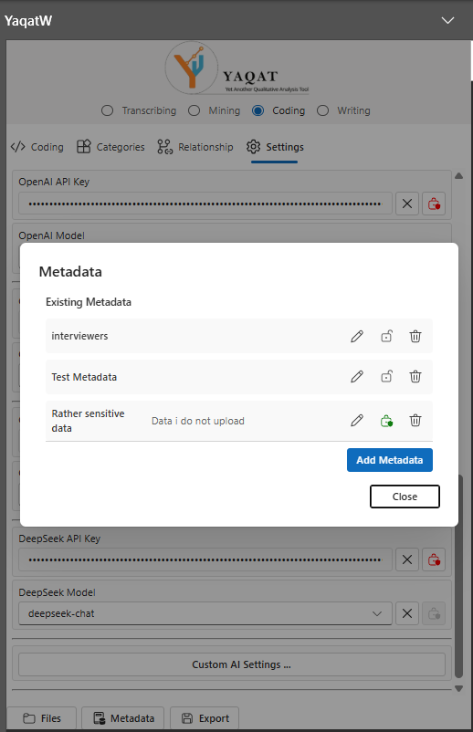

---

## Workflow Guide

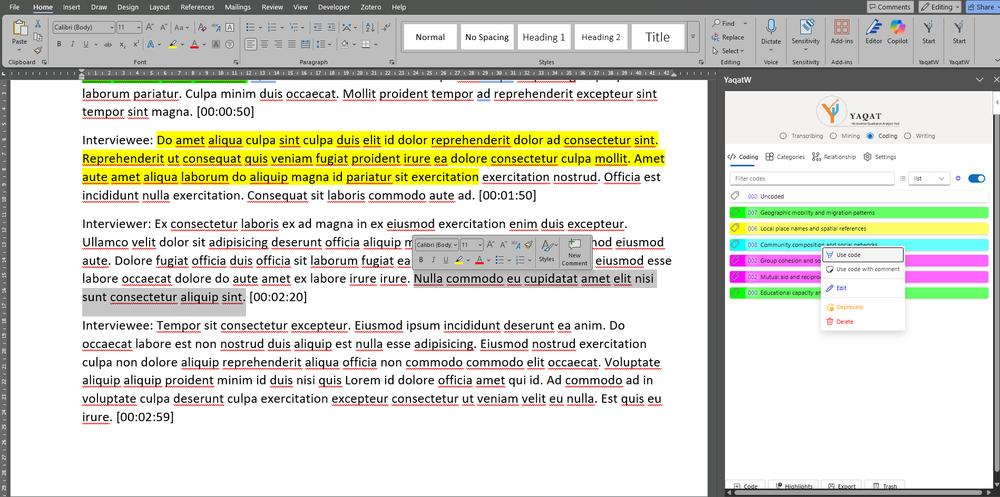

The modes are designed to be used on their own, but they also fit together into a full workflow. The sequence below is roughly how I work through a project myself; treat it as a suggestion rather than a rule, and reorder it to suit your own style.

**Phase 1: Set up the document**

1. Create or open a Word document and open YaqatW.
2. Complete Settings (project name, password, file ID, user name).
3. Confirm the Document Type is **Analysis**.
4. Connect cloud sync (optional, but recommended).

**Phase 2: Get to know the data (Mining)**

1. Use **Search** to locate the key terms from your research questions.
2. Use **Frequency** and **Stats** to see the dominant topics and the speaker patterns.
3. Use **Co-occurrence** to spot which concepts cluster together.

**Phase 3: Code**

1. In **Coding**, read through and create codes as you go.
2. Select text and apply codes; adjust colors for clarity.
3. Optionally, for non-sensitive data, use the **AI Code Agent** for suggestions, then accept or edit them.

**Phase 4: Organize**

1. Group related codes into **Categories**.
2. Check that codes belong to categories. Nest **Categories** by drag and drop for higher level of abstraction.
3. Document **Relationships** (cause–effect, temporal, and so on).
4. Merge or delete redundant codes, recovering from **Trash** if you change your mind.

**Phase 5: Analyze**

1. In **Analyzing**, drag codes, categories, and metadata into the analysis zones.
2. Run comparisons and review the results.

**Phase 6: Document and sync**

1. Add **Metadata** using placeholders and general descriptors.
2. Capture **Artifacts** and **Notes** in Documenting mode.
3. Click **Sync Now** to back up to your cloud provider.

**Phase 7: Write and export**

1. In a separate **Writing document**, use **Cite** to insert quotes, figures, and tables.
2. Export data to Excel / CSV / JSON for any further analysis you want to do elsewhere.

---

## How Your Data Is Stored

I think it is worth understanding where your work actually lives, because it explains why YaqatW is more resilient than a typical browser tool, and, just as importantly, where its limits are. Your data is kept in up to three places at once, and they back each other up.

### The three places your data lives

1. **Inside the Word document itself.** Your codes, categories, relationships, layers, and the highlights for that document are written into the document's own *custom XML*, a hidden data area that is part of the `.docx` file. This is the part people underestimate: because the data is inside the file, it travels with the file. If you email the `.docx`, copy it to a USB stick, or restore it from a backup, your coding goes with it. The document *is* a backup.

2. **In a local store on this device.** YaqatW also keeps a project-wide copy in a small database in your browser/Word profile (technically IndexedDB, with audio kept separately). This is the *authoritative working copy* and the only place that aggregates data across **all** the files in a project, so the document you have open can show codes that were created while working on a different document in the same project. Binary attachments (artifact images, audio) live here too. This is also the layer that a "clear browsing data," a profile reset, or the "Limited storage mode" condition can wipe.

3. **In your own cloud account.** When you connect a provider, the local store is mirrored into the `YaqatW-DATA` folder in *your* Google Drive, OneDrive, Dropbox, Nextcloud, or S3 (see [Cloud Sync](#cloud-sync)). This copy is off your machine entirely, so it survives even a dead laptop.

### How the copies heal each other

These three are not independent silos; they reconcile whenever you open a document:

- **The shared parts of your project are redundant by design.** Codes, categories, relationships, layers, and artifact records are stored as a *project-wide* set. Every document you open keeps its own embedded copy of that set in its custom XML, and on open YaqatW merges the document's copy with the local store in both directions. So if the local store is wiped, **simply reopening a document re-seeds it from the copy embedded in that `.docx`.** And if the cloud copy is deleted or has never existed, the next sync re-uploads it from what is on your machine. Deletions propagate too (through tombstones), so a code you delete in one file does not silently come back from another.
- **This is why a browser crash is usually recoverable.** A lost local database does not mean lost work, as long as you still have any reasonably recent `.docx` from the project (or a cloud copy). The document carries the codes; opening it rebuilds the rest.

### The limits, and where they bite

Redundancy is not the same as a guarantee, and there are two edges to be aware of:

- **Some data is per-file, not shared.** The coded passages themselves (highlights), along with a document's notes and metadata, belong only to *that* document; they are *not* duplicated into your other files the way codes and categories are. So if you lose a specific `.docx` **and** its local copy **and** any cloud copy, that file's highlights, notes, and metadata are gone, even though the project's shared codes survive elsewhere.
- **A document only holds as much as it knew when last opened.** Each `.docx` embeds the shared set *as of the last time you opened it with the full data available*. If you are recovering, **open your most recently used file**, since it carries the most complete copy. An old, long-untouched document will only have the codes that existed back when you last opened it.

### A word of responsibility (and the disclaimer)

I have put real effort into this layered, self-healing design precisely because I know how much a lost dataset hurts. But I want to be straight with you: **YaqatW is free software provided "as is," and I cannot be responsible for data loss.** There is no central YaqatW server holding a copy of your work to fall back on; that is the privacy trade-off you read about earlier, and it cuts both ways. The safety net is the redundancy above plus your own habits.

So please, treat your own backups as the real guarantee:

- Keep cloud sync on, and **Sync Now** before and after important sessions.
- Keep ordinary file backups of your `.docx` documents, ideally in more than one location.
- For a critical milestone, save a dated copy of the document.

For the full legal version of this (the disclaimer of warranties, the limitation of liability, and your backup responsibilities), see the [Terms of Service](https://yaqatw.alefa.net/public/terms.html). None of this is meant to alarm you; it is the normal footing for free, privacy-first software, and the design does its best to keep your work safe.

---

## Cloud Sync

### Why sync at all?

- **Backup.** It protects your work against an accidental deletion or a dead computer.
- **Multiple devices.** You can reach your project from a laptop, a tablet, or another machine.
- **Collaboration.** (Experimental.) You can share a project with the rest of a research team.
- **On your terms.** Click "Sync Now" whenever you like, or set an interval and let it remind you to do so.

### Supported providers

- **Google Drive™**, **Dropbox**, **OneDrive** (Microsoft 365), and **Nextcloud** (self-hosted) all connect through a secure sign-in (OAuth): you log in once and authorize the add-in. Due to security restrictions in place, that prevent the app from connecting to a random domain, Nextcloud cannot run for the moment. We are looking for a way to let the user allow whitelist certain domains.
- **Amazon S3** and **S3-compatible** storage connect with an endpoint, region, bucket, and access keys. After saving those, use **Test connection** to confirm they work. Due to the restriction above, S3 is also restrictide to well-knonwn domains.

### How to sync

**The first time:**

1. Go to **Settings → Cloud Server** and select a **Back end**.
2. For the OAuth providers, click **Connect** and sign in or authorize in the dialog that opens. For S3, fill in the endpoint, region, bucket, and keys, then **Test connection**.
3. Click **Sync Now**. A `YaqatW-DATA` folder is created in your account and your data is uploaded into it.

**Every time after that:** just click **Sync Now**. You will not be asked to sign in again until the token expires.

### What gets synced?

- ✅ Codes, categories, relationships
- ✅ Highlights and metadata
- ✅ Notes and artifacts (artifact files are stored in the cloud folder)
- ✅ Per-file settings
- ⚠️ Encrypted fields, but only if encryption is enabled
- ⚠️ Encrypted full text for mining (this does not mean a lost file can be restored. This is just to simplify text mining.)

### When syncs collide

If you edit the same project on two devices before syncing, the **most recent edit wins**, decided by modification timestamp. To stay out of trouble, get into the habit of syncing both before and after you work, and if a particular change is critical, keep a separate backup of the document too.

### Working offline

- Without cloud sync, your work lives only on this one computer, in the Word document and the local store described in [How Your Data Is Stored](#how-your-data-is-stored). There is no cloud backup and no access from another device. The good news is that the `.docx` file itself carries your codes, so keeping ordinary backups of the document protects most of your work; the real risk is losing the document file *and* the local store together, which would take a file's highlights with it.
- Use **Settings → Prepare for offline use** to cache the app so it loads without an internet connection. (AI, translation, and sync still need a connection; only the app itself works offline.)
- **My recommendation:** use cloud sync. If you prefer to stay offline, back up your document regularly to external storage.

---

## Encryption & Security

### Start by not storing the sensitive thing at all

I want to lead with this because it is the most important point, and encryption is no substitute for it: **the safest sensitive data is the data you never put into YaqatW.**

- **Use placeholder codes** for participants (e.g. "P-001").
- **Keep the participant mapping in a separate, secure file** outside YaqatW.
- **Minimize context data.** Use general descriptors like "Interview Round 2" or "Region A" instead of specifics.
- Only include the metadata that is necessary.

And here is a point that catches people out, so I want to be very clear: **when encryption is enabled, only the data sent to the cloud is encrypted. Your research content stored on your own computer remains unencrypted**: the codes, highlights, notes, and metadata values live in plaintext inside the Word document. (There is one deliberate exception, credentials, covered under [What gets encrypted](#what-gets-encrypted) below.) Because your content sits unencrypted on disk, you must protect the machine itself:

- ✅ Use a strong account password and lock your computer when you step away.
- ✅ Store documents in your protected user folder.
- ✅ Enable full-disk encryption (BitLocker on Windows, FileVault on macOS).
- ❌ Never leave the computer unlocked or share a user account.
- ❌ Never work on a shared computer with YaqatW

### When should you encrypt?

Turn encryption on if your data contains sensitive research content (coded quotes, health or financial information) or if you must comply with GDPR, HIPAA, or an institutional policy. But **do not reach for encryption as a way to justify storing identifiers**: de-identify first, then encrypt what remains.

### How to turn it on

1. Go to **Settings → Data Password**, enter a strong password (8+ characters) and confirm it.
2. Check **Encrypt cloud data**.
3. Save.

### What gets encrypted

It helps to separate the two places your data lives, the cloud and your own disk, because what is encrypted differs between them.

**In the cloud (when "Encrypt cloud data" is on):** the *content* is encrypted: text excerpts, translations, comments, and notes. The *structure* stays readable, so code names and category structure remain visible. In other words, someone with access to your cloud folder could see that you have a code called "Leadership," but not read the quotes you attached to it.

**On your computer:** your research content is *not* encrypted at rest. Codes, highlights, notes, and metadata values sit in plaintext in the Word document, so that the add-in can read and write them as you work. There are two exceptions, both encrypted locally with a master key derived from your **data password**:

- **Credentials.** Your provider API keys (OpenAI, Claude, Gemini, Groq, DeepSeek, Google, DeepL) and cloud access secrets (such as S3 access keys and Nextcloud OAuth secrets) are encrypted before they are stored, so they are never written to the document in readable form.
- **Locked metadata fields.** Any metadata field you lock with the 🔒 icon (see [Metadata](#metadata-and-a-word-about-privacy)) is encrypted the same way.

A practical consequence worth understanding: the master key that unlocks those credentials is derived from your data password and, by default, kept only in memory for the session, so it is gone when the pane closes and you re-enter the password next time. If you enable **Remember password on this device**, the key is instead stored on that specific machine, which is convenient but means anyone who can use the add-in on that machine could decrypt your stored keys. Leave it off on shared computers.

### ⚠️ Three warnings worth repeating

1. **Lost password means lost data.** A forgotten password makes encrypted data **permanently unrecoverable**. Store it in a password manager, and keep a printed backup somewhere safe.
2. **Encryption cannot be undone after the fact.** Disabling encryption later does **not** decrypt the data you already encrypted; it will simply appear as unreadable gibberish.
3. **Shared projects need a shared password.** Every collaborator must use the same password, and you should communicate it through a secure channel, never over email or chat.

### Good habits

- ✅ Use a strong password such as `Res!rch2024Strong`.
- ✅ Keep it in a password manager (1Password, Bitwarden, LastPass).
- ❌ Do not use a simple password, and do not write it on a sticky note.

---

## Export & Analysis

### Formats

YaqatW exports from the Mining footers and the coding tabs in several formats: **Excel (XLSX)**, **CSV**, **JSON**, **HTML**, and **Word (DOCX)**. Word clouds and co-occurrence maps export as **PNG / SVG** images. Many tabs offer both **Export** (the current view) and **Export All**.

> **A tip on HTML vs. Word:** export **as HTML** when you just want to preview the result and copy it somewhere else, and export **as Word** when you want to keep the file itself.

> **macOS note (please read if you are on a Mac):** unlike Windows and the web, which download exports straight to your machine, macOS cannot trigger a file download from inside a Word add-in. So on macOS, YaqatW uploads each export to your connected cloud provider under `<project>/export/` and opens it in a browser window, where you can **Save As**. This means that on a Mac, **a cloud provider must be connected** (Settings → Cloud) and **a project name must be set** before export will work; otherwise it fails and prompts you to connect one.

### Exporting the code book

The **code book** is your list of codes and their definitions:

1. Go to the **Codes** tab → **Export** (at the bottom) → **Save Code Book** → **Options**.
2. In the options dialog, tick what to include (for example **Code**, **Description**, and **Color**), then **Close**.
3. **Export → Save Code Book → Save as HTML** (to preview and copy) or **Save as Word** (to keep).

### Exporting categories and relationships

Exporting categories or relationships works the same way, but with richer options. Beyond the structure itself, you can include, for each coded item: the **selected text**, its **translation**, the **code applied**, the **category** (or relationship), and any of your saved **metadata** fields. Open **Options** to choose exactly which of these columns appear.

### Exporting to Excel

You can export everything into a single Excel workbook, with one sheet per data type.

1. In **Settings**, open the footer **Export** menu and choose **Export workbook…**.
2. Choose which sheets to include: Data (highlights with codes), Codes, Categories, Relationships, Metadata.
3. Choose the scope — **All files** or **This file only**.
4. Click **Export workbook** to download.

Each sheet uses the column choices you set in that data type's **Options** dialog (in the Codes, Categories, and Relationships tabs). For example, you can deliberately leave out sensitive columns (Date, Participant ID) there to reduce the risk of re-identification, and the workbook will honor that.

You can still export any single data type on its own from its tab's **Export** menu if you only need one sheet.

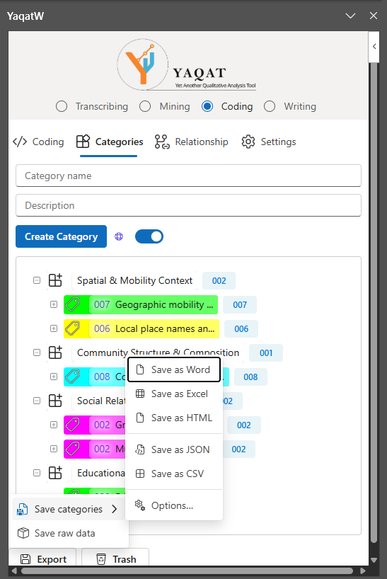

### Going further

Once your data is in Excel you can build pivot tables for code frequencies, cross-tabulate codes against participants or dates, generate charts, compute co-occurrence, and export onward to R, SPSS, or Python for heavier analysis. (You can also do much of this without leaving the add-in, in [Analyzing Mode](#analyzing-mode).)

---

## AI & Translation

YaqatW can connect to optional AI and translation providers. They are entirely optional (everything else works without them), and **all keys are stored locally on your machine.** Please read the security note before you configure anything.

⚠️ **SECURITY NOTE:** API keys are stored locally on your computer and are never sent to YaqatW servers; they go only to the provider you configured. They are also **encrypted at rest**, using a master key derived from your data password, so they are not written into the Word document in readable form (see [What gets encrypted](#what-gets-encrypted)). That protection is only as strong as your data password and how you handle it: if you turn on **Remember password on this device**, the decryption key is kept on that machine, so anyone who can use the add-in there could read your keys. As a general rule, only configure providers on a computer that is personally owned, password-protected, locked when unattended, and disk-encrypted (BitLocker / FileVault), and leave "remember password" off on shared machines.

### Before you send research data to a third-party AI

This one matters more than the key-storage note above, so please read it carefully. When you translate a quote or run the Code Agent, the text you send leaves your machine and goes to the provider you configured: OpenAI, Anthropic, Google, and so on. YaqatW is not in the middle of that exchange, which is good for your privacy from *us*, but it also means **YaqatW cannot make any promise about what the provider does with your data.** That responsibility sits with you, and for participant data it is a research-ethics question, not only a technical one.

Before sending real research data to any AI or translation API, please check, for each provider you use:

- **Is your data used to train their models?** Policies differ by provider and, importantly, by tier: a provider's consumer chat product and its paid API often have very different rules, and a "no-training" guarantee on one does not carry over to the other. Read the data-usage terms for the **specific API and plan** you are on, and look for a documented opt-out or a business/enterprise tier if you need one.
- **How long is your data retained,** and is it logged or reviewed by humans for abuse monitoring? Retention windows vary, and some plans let you request zero-retention.
- **Where is it processed** (which country/jurisdiction)? This can matter for GDPR and for institutional data-residency rules.

And before any of that, check whether sending the data is permitted at all:

- **Consent.** Did your participants consent to their words being processed by a third-party AI service? Generic "data will be analyzed" consent usually does not cover this.
- **IRB / ethics approval.** Many ethics boards treat sending identifiable data to an external service as a disclosure that must be declared and approved in advance. If your protocol does not mention third-party AI processing, assume you need to clear it first.
- **De-identify first.** The safest course is the one the [Encryption & Security](#encryption--security) section already urges: strip identifiers before the text ever reaches an AI. Code with placeholders, and keep the real mapping out of YaqatW entirely. The provider cannot mishandle an identifier you never sent it.

None of this is meant to scare you off; used carefully, these features are very useful. It is simply that the "bring your own keys" design hands you both the control *and* the responsibility, and I would rather you go in with eyes open than discover the terms after the fact.

### Translation

To translate a highlighted quote in another language: select the highlight and click **Translate** (this appears once a provider is configured), then optionally save the translation back onto the highlight.

**Supported translation providers:**

- **Google Translate™** (recommended): create a key at https://console.cloud.google.com/ (enable the Cloud Translation API), then paste it into **Settings → Google API Key**. This works directly from the add-in and depends on nothing but your own key, so it is the most reliable option.
- **DeepL** (experimental, highest quality): https://www.deepl.com/pro#developer. Paste the key into **Settings → DeepL API Key**. DeepL cannot be called directly from a browser, so YaqatW routes these requests through a small hosted proxy. **Treat this as experimental and unstable, and please do not abuse it:** there is a shared cap of 100,000 requests across *all* users. As the user base grows, I expect to move to a paid proxy and eventually pass that cost on to the users who opt in — so do not build a workflow that assumes free, unlimited DeepL.

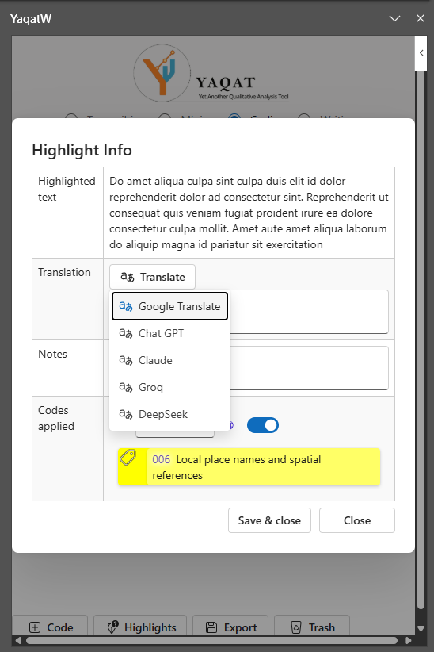

### AI providers (for the Code Agent)

Configure any of these under **Settings → API Settings**. Each has an API key, a model selector, and an optional max-tokens field:

| Provider | Where to get a key |
|---|---|
| **OpenAI** | https://platform.openai.com/api-keys |
| **Claude (Anthropic)** | https://console.anthropic.com/ |
| **Groq** | https://console.groq.com/keys |
| **Gemini (Google)** | https://aistudio.google.com/app/apikey |
| **DeepSeek** | https://platform.deepseek.com/api |

There is also a **Custom AI Settings** option that lets advanced users point at a custom provider or endpoint. AI is used for the **Code Agent** suggestions (Coding mode), **filter-list generation** (Mining mode), and optional **segment transcription** (Transcribing mode). Costs are pay-per-use and are tracked in each provider's own dashboard, not by YaqatW.

> All AI, translation, and cloud features need an internet connection. When you are offline, YaqatW shows a banner and these particular features are unavailable.

### Managing API cost and keys

Because you bring your own keys, the cost and the security of those keys are yours to manage, and YaqatW deliberately stays out of the way: it never sees your usage and cannot cap your spending for you. That is the privacy trade-off the whole design rests on, but it does mean a runaway script or a leaked key is your bill to pay, so it is worth spending a few minutes in each provider's dashboard before you lean on these features. None of this is hard; it is the same housekeeping you would do for any API key.

**Put a ceiling on spending.** This is the single most important step, and YaqatW cannot do it for you, because billing lives entirely on the provider's side. In each provider's dashboard, set a hard budget or usage limit so a mistake cannot run up an open-ended bill:

- **OpenAI** — *Settings → Limits*, where you can set a monthly budget and an email alert threshold.
- **Claude (Anthropic)** — *Plans & billing → Cost management*, with spend limits and alerts.
- **Gemini (Google)** and **Google Translate** — set a budget and alerts on the billing account in the [Google Cloud console](https://console.cloud.google.com/), and (for Translate) consider an API quota on the Cloud Translation API.
- **Groq** and **DeepSeek** — both are prepaid/credit-based, so your exposure is naturally capped at the credit you have loaded; top up deliberately rather than enabling auto-recharge.

Where a provider offers it, prefer a *hard* cap that stops requests over a *soft* alert that only emails you after the fact. A budget set at the provider is the only thing that reliably bounds your spend; the controls inside YaqatW shape individual requests but do not cap the total.

A word of caution on the **max-tokens** field in *Settings → API Settings* (see above): it is tempting to set it low to "save money," but that usually backfires. If the limit is below what a response actually needs, the output is truncated and unusable, so you run it again — and you are charged for every one of those failed attempts, including the input tokens of your document each time. A max-tokens set too tight is *more* expensive than a generous one, because you pay repeatedly for results you cannot use. Set it high enough that a normal run completes in one go, and rely on the provider's budget cap — not a starved token limit — to protect you from runaway cost. The **Code Agent**'s cap on *new codes* is different and safe to tighten: it limits how much the model is asked to produce, not how much room it has to finish.

**Watch usage early on.** The first few times you use the Code Agent or batch-translate, check the provider's usage dashboard afterwards to see what a typical run actually costs you. The Agent reads your *whole document*, so it is the most expensive operation in the add-in; knowing its real cost before you run it across twenty interviews saves surprises.

**Verify your account deliberately.** Most providers raise your default rate limits and unlock higher tiers once you have verified an email, a phone number, or a payment method. That is convenient, but a verified account with a saved card is also the one that can run up a real bill — so verify only the providers you actually intend to use, and pair verification with the spending cap above rather than treating it as a step to rush through.

**Rotate, refresh, and delete keys.** Treat each key as a credential, not a set-and-forget setting:

- **Delete unused keys.** If you stop using a provider, revoke its key in the provider's dashboard *and* clear it from *Settings → API Settings*. A key that exists nowhere cannot be misused.
- **Rotate on a schedule, or after any exposure.** Generate a fresh key periodically, and immediately if a key may have been seen by anyone — pasted into a chat, committed to a repo, or used on a shared machine. Revoking the old key in the dashboard makes it dead the moment you do it; pasting the new one into YaqatW takes a few seconds.
- **One key per purpose where you can.** Several providers let you create multiple named keys. A separate key for YaqatW makes it easy to revoke *just* that key without disturbing your other tools, and easy to see in the dashboard what the add-in is costing you.
- **Mind where the key is decryptable.** YaqatW encrypts keys at rest with your data password (see the security note above), but if **Remember password on this device** is on, anyone who can use the add-in on that machine can use your keys. On a shared or borrowed computer, leave "remember password" off, and rotate any key you used there afterwards.

If a key ever stops working, the usual cause is that it was revoked or regenerated on the provider's side, or the account's credit ran out or its budget cap was hit — regenerate the key in the dashboard, paste the new one into *Settings → API Settings*, and check the account's billing status.

---

## Troubleshooting

### Common issues and what to do

| Problem | Likely cause | What to do |
|---------|-------|----------|
| "Settings not initialized" | A required setup field is missing | Complete Project, Password, File ID, and User, then Save |
| Highlights not appearing | No text was selected, or a transient error | Re-select the text and apply again; refresh the document |
| "Limited storage mode" banner | IndexedDB is unavailable | Coding data still saves, but attachments and large files cannot; restart Word, or update Office / your browser |
| "Audio features unavailable" banner | The OS lacks the required file storage (macOS < 13) | Update your OS to enable audio import, transcription, and diarization |
| Cloud sync fails | An OAuth token expired, or S3 credentials are wrong | Reconnect the provider in Settings; for S3, use **Test connection** |
| "Password incorrect" | The wrong password | Check CAPS LOCK and confirm it matches the original |
| AI or translation request fails | The key was revoked/regenerated, credit ran out, or a budget cap was hit | Regenerate the key in the provider dashboard, paste it into **Settings → API Settings**, and check the account's billing status (see [Managing API cost and keys](#managing-api-cost-and-keys)) |
| Diarization will not run | No enrolled speakers | Enroll at least one speaker on the Transcribe tab first |
| Encryption shows gibberish | The data was encrypted with a different password | Use the original password; if it is lost, the data is unrecoverable |

### Getting help

- **Report an issue:** https://github.com/yaqalab/yaqatw-support/issues (please include the error message from the F12 console, the steps to reproduce it, your Word or browser version, and your cloud provider if it is relevant).
- **Documentation and feature requests:** https://github.com/yaqalab/yaqatw-support

---

## FAQ

**Q: Is my data private?**  
A: Yes. Your coding data lives in three places, all of which are yours: your Word document, a local IndexedDB scoped to the add-in on your computer, and your own cloud account. YaqatW never sends your data to our servers; all processing happens locally through Office.js. **YaqatW does not collect usage data, personal information, or research content.** If you enable encryption, sensitive content is protected before it is sent to the cloud and cannot be read without your password, so keep that password safe, because encrypted data cannot be recovered if it is lost. **For your research content, encryption applies only to cloud sync; that content is stored unencrypted on your computer** (credentials such as API keys are the exception: they are encrypted locally with your data password). So protect your machine with a strong password and disk encryption. For the full details, see our [Privacy Policy](https://yaqatw.alefa.net/public/privacy.html).

**Q: Can I recover a deleted code?**  
A: Yes. Deleting a code removes only the definition, not its highlights, which stay in the document. The **Trash** tab shows recently deleted items so you can restore them. You can also permanently delete an item from there, and after that there is no recovery.

**Q: What is the difference between an Analysis document and a Writing document?**  
A: An **Analysis document** holds your source data and supports every mode, including Coding and Transcribing. A **Writing document** is your manuscript and exposes only Writing, Analyzing, Mining, and Documenting. You can switch a document to Writing type only if it has no highlights. Keep both under the same project name so they share codes and data.

**Q: Can I share a project with my research team?**  
A: Yes. One member creates the project, syncs, and shares the `YaqatW-DATA` cloud folder. The others configure YaqatW with the **same project name**, connect to the shared folder, and click **Sync Now** to pull in the existing codes and data. Each person works on separate documents (different File IDs) while sharing the same codes, categories, and relationships. **Never edit the same file at the same time**: always sync before and after working, and remember the last sync wins. Each researcher uses their own cloud credentials.

**Q: What if I lose my password?**  
A: If encryption is enabled, the encrypted data is **unrecoverable** without the password. Store the password securely, in a password manager, with a backup.

**Q: Can I use YaqatW in Excel or PowerPoint?**  
A: Not yet; YaqatW is Word-only for now. We are exploring deeper integration with other Office apps (for example, reading coding data in Excel) for the future.

**Q: How big can my document be?**  
A: For the best performance, keep each document under about 50 MB. Very large documents (100+ MB) can slow Word and the add-in down, because highlights, codes, and annotations are processed in real time. For large projects, split the work across several documents, ideally one per interview or source.

**Q: Does YaqatW work offline?**  
A: Yes, all your work is local until you sync. Use **Prepare for offline use** to cache the app itself. AI, translation, and cloud sync still need internet. The trade-off is that offline means no automatic backup, so back up your document regularly if you stay offline.

**Q: What happens to my data if my browser is reset, or my computer dies?**  
A: Less than you might fear, but it depends on what you still have. Your codes, categories, and relationships are embedded inside each Word document as well as in YaqatW's local store, so if the local store is cleared, just reopen a document and it re-seeds itself; for best results open your most recently used file, which holds the most complete copy. If you also use cloud sync, an off-machine copy is waiting regardless. The real risk is losing a document file together with its local and cloud copies, which would take that file's highlights, notes, and metadata with it, since those are stored per-file (unlike codes) and not duplicated elsewhere. The full picture is in [How Your Data Is Stored](#how-your-data-is-stored). And to be clear: the design does its best, but YaqatW is provided "as is" with no guarantee against data loss; your own backups are the real safety net (see [Terms of Service](https://yaqatw.alefa.net/public/terms.html)).

**Q: Can I export my data to other formats?**  
A: Yes: **Excel (XLSX)**, **CSV**, **JSON**, **HTML**, and **Word (DOCX)**, plus **PNG / SVG** for word clouds and co-occurrence maps. Each data type (codes, categories, relationships, highlights) can be exported separately.

**Q: What is the catch? How do you make money from my data?**  
A: We don't, and that is the point. There is no YaqatW account, no YaqatW server holding your research, and no usage or personal data collected (see [Privacy by design](#privacy-by-design)). The model is bring-your-own: your own cloud account for sync, your own API keys for any AI or translation, and your own password for encryption. Because there is no backend to run on your behalf, there is also nothing to subscribe to, so YaqatW is free to use, with no account and no hidden costs. The only money that ever changes hands is what you pay your AI or translation provider directly, if you choose to use one, and that is billed by them, not by us.

**Q: Is there a mobile app?**  
A: No. Office Add-ins are not supported in the Word mobile apps for iOS® or Android™, owing to Microsoft platform limitations. Use YaqatW on Word for Windows, macOS, or the web. On a tablet, use the full desktop or web version of Word.

**Q: Will YaqatW be open source?**  
A: The source is proprietary for now, while we develop it, but we are committed to releasing it as open source once the project reaches broader adoption.

---

## Contributors

**Main contributors:** [frianasoa](https://github.com/frianasoa)

---

## Thank You

Thank you for using YaqatW. Your feedback matters to a project this size, so please share your thoughts, problems, and feature requests on [GitHub Issues](https://github.com/yaqalab/yaqatw-support/issues).

Happy coding.
